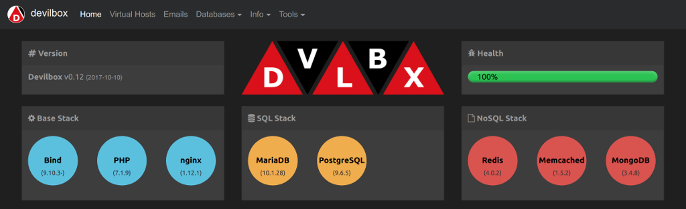

<p align="center">
    <h1 align="center">The devilbox</h1>
</p>


[](https://gitter.im/devilbox/Lobby?utm_source=badge&utm_medium=badge&utm_campaign=pr-badge&utm_content=badge)


**[Usage](#usage)** |
**[Features](#feature-overview)** |
**[Documentation](#documentation)** |
**[Intranet](#intranet-overview)** |
**[Screenshots](#screenshots)** |
**[Contributing](#contributing)** |
**[Logos](#logos)** |
**[License](#license)**



[](https://travis-ci.org/cytopia/devilbox)  [](https://www.docker.com/) [](https://opensource.org/licenses/MIT)

The devilbox is a modern and highly customisable **dockerized PHP stack** supporting full **LAMP** and **MEAN** and running on all major platforms. The main goal is to easily switch and combine any version required for local development. It supports an unlimited number of projects for which vhosts and DNS records are created automatically. Email catch-all and popular development tools will be at your service as well.  Configuration is not necessary, as everything is pre-setup with mass virtual hosting.

  


## Usage

#### Quick start

You are up and running in four simple steps:

```shell
# Get the devilbox
$ git clone https://github.com/cytopia/devilbox
$ cd devilbox

# Create docker-compose environment file
$ cp env-example .env

# Edit your configuration
$ vim .env

# Start all containers
$ docker-compose up
```

#### Selective start

The above will start all containers, you can however also just start the containers you actually need. This is achieved by simply specifying them in the docker-compose command.

```shell
$ docker-compose up httpd php mysql redis
```


#### Run different versions

Every single attachable container comes with many different versions. In order to select the desired version for a container, simply edit the `.env` file and uncomment the version of choice. Any combination is possible.

<table>
  <thead>
    <tr>
      <th>Apache</th>
      <th>Nginx</th>
      <th>PHP</th>
      <th>MySQL</th>
      <th>MariaDB</th>
      <th>Percona</th>
      <th>PgSQL</th>
      <th>Redis</th>
      <th>Memcached</th>
      <th>MongoDB</th>
    </tr>
  </thead>
  <tbody>
    <tr>
      <td><a target="_blank" title="Apache 2.2"       href="https://github.com/devilbox/docker-apache-2.2">2.2</a></td>
      <td><a target="_blank" title="Nginx stable"     href="https://github.com/devilbox/docker-nginx-stable">stable</a></td>
      <td><a target="_blank" title="PHP 5.4"          href="https://github.com/cytopia/docker-php-fpm-5.4">5.4</a></td>
      <td><a target="_blank" title="MySQL 5.5"        href="https://github.com/cytopia/docker-mysql-5.5">5.5</a></td>
      <td><a target="_blank" title="MariaDB 5.5"      href="https://github.com/cytopia/docker-mariadb-5.5">5.5</a></td>
      <td><a target="_blank" title="PerconaDB 5.5"    href="https://github.com/cytopia/docker-percona-5.5">5.5</a></td>
      <td><a target="_blank" title="PgSQL 9.1"        href="https://github.com/docker-library/postgres">9.1</a></td>
      <td><a target="_blank" title="Redis 2.8"        href="https://github.com/docker-library/redis">2.8</a></td>
      <td><a target="_blank" title="Memcached 1.4.21" href="https://github.com/docker-library/memcached">1.4.21</a></td>
      <td><a target="_blank" title="MongoDB 2.8"      href="https://github.com/docker-library/mongo">2.8</a></td>
    </tr>
    <tr>
      <td><a target="_blank" title="Apache 2.4"       href="https://github.com/devilbox/docker-apache-2.4">2.4</a></td>
      <td><a target="_blank" title="Nginx mainline"   href="https://github.com/devilbox/docker-nginx-mainline">mainline</a></td>
      <td><a target="_blank" title="PHP 5.5"          href="https://github.com/cytopia/docker-php-fpm-5.5">5.5</a></td>
      <td><a target="_blank" title="MySQL 5.6"        href="https://github.com/cytopia/docker-mysql-5.6">5.6</a></td>
      <td><a target="_blank" title="MariaDB 10.0"     href="https://github.com/cytopia/docker-mariadb-10.0">10.0</a></td>
      <td><a target="_blank" title="PerconaDB 5.6"    href="https://github.com/cytopia/docker-percona-5.6">5.6</a></td>
      <td><a target="_blank" title="PgSQL 9.2"        href="https://github.com/docker-library/postgres">9.2</a></td>
      <td><a target="_blank" title="Redis 3.0"        href="https://github.com/docker-library/redis">3.0</a></td>
      <td><a target="_blank" title="Memcached 1.4.22" href="https://github.com/docker-library/memcached">1.4.22</a></td>
      <td><a target="_blank" title="MongoDB 3.0"      href="https://github.com/docker-library/mongo">3.0</a></td>
    </tr>
    <tr>
      <td></td>
      <td></td>
      <td><a target="_blank" title="PHP 5.6"          href="https://github.com/cytopia/docker-php-fpm-5.6">5.6</a></td>
      <td><a target="_blank" title="MySQL 5.7"        href="https://github.com/cytopia/docker-mysql-5.7">5.7</a></td>
      <td><a target="_blank" title="MariaDB 10.1"     href="https://github.com/cytopia/docker-mariadb-10.1">10.1</a></td>
      <td><a target="_blank" title="PerconaDB 5.7"    href="https://github.com/cytopia/docker-percona-5.7">5.7</a></td>
      <td><a target="_blank" title="PgSQL 9.3"        href="https://github.com/docker-library/postgres">9.3</a></td>
      <td><a target="_blank" title="Redis 3.2"        href="https://github.com/docker-library/redis">3.2</a></td>
      <td><a target="_blank" title="Memcached 1.4.23" href="https://github.com/docker-library/memcached">1.4.23</a></td>
      <td><a target="_blank" title="MongoDB 3.2"      href="https://github.com/docker-library/mongo">3.2</a></td>
    </tr>
    <tr>
      <td></td>
      <td></td>
      <td><a target="_blank" title="PHP 7.0"          href="https://github.com/cytopia/docker-php-fpm-7.0">7.0</a></td>
      <td><a target="_blank" title="MySQL 8.0"        href="https://github.com/cytopia/docker-mysql-8.0">8.0</a></td>
      <td><a target="_blank" title="MariaDB 10.2"     href="https://github.com/cytopia/docker-mariadb-10.2">10.2</a></td>
      <td></td>
      <td><a target="_blank" title="PgSQL 9.4"        href="https://github.com/docker-library/postgres">9.4</a></td>
      <td><a target="_blank" title="Redis 4.0"        href="https://github.com/docker-library/redis">4.0</a></td>
      <td><a target="_blank" title="Memcached 1.4.23" href="https://github.com/docker-library/memcached">1.4.24</a></td>
      <td><a target="_blank" title="MongoDB 3.4"      href="https://github.com/docker-library/mongo">3.4</a></td>
    </tr>
    <tr>
      <td></td>
      <td></td>
      <td><a target="_blank" title="PHP 7.1"          href="https://github.com/cytopia/docker-php-fpm-7.1">7.1</a></td>
      <td></td>
      <td><a target="_blank" title="MariaDB 10.3"     href="https://github.com/cytopia/docker-mariadb-10.3">10.3</a></td>
      <td></td>
      <td><a target="_blank" title="PgSQL 9.5"        href="https://github.com/docker-library/postgres">9.5</a></td>
      <td></td>
      <td>...</td>
      <td><a target="_blank" title="MongoDB 3.5"      href="https://github.com/docker-library/mongo">3.5</a></td>
    </tr>
    <tr>
      <td></td>
      <td></td>
      <td><a target="_blank" title="PHP 7.2"          href="https://github.com/cytopia/docker-php-fpm-7.2">7.2</a></td>
      <td></td>
      <td></td>
      <td></td>
      <td><a target="_blank" title="PgSQL 9.6"        href="https://github.com/docker-library/postgres">9.6</a></td>
      <td></td>
      <td><a target="_blank" title="Memcached 1.5.2"  href="https://github.com/docker-library/memcached">1.5.2</a></td>
      <td></td>
    </tr>
    <tr>
      <td></td>
      <td></td>
      <td><a target="_blank" title="HHVM"             href="https://github.com/cytopia/docker-hhvm-latest">HHVM</a></td>
      <td></td>
      <td></td>
      <td></td>
      <td><a target="_blank" title="PgSQL 10.0"       href="https://github.com/docker-library/postgres">10.0</a></td>
      <td></td>
      <td><a target="_blank" title="Memcached latest" href="https://github.com/docker-library/memcached">latest</a></td>
      <td></td>
    </tr>
  </tbody>
</table>

#### Enter the container

You can also work directly inside the php container. Simply use the bundled scripts `shell.sh`. The `PS1` will automatically be populated with current chosen php version.
```shell
# Enter as user devilbox (normal operation / development)
host> ./shell.sh
devilbox@php-7.0.19 in /shared/httpd $
```
```shell
# Enter as root user (do root stuff)
host> ./shell.sh
devilbox@php-7.0.19 in /shared/httpd $ sudo su -
root@php-7.0.19 in /shared/httpd $
```

Your projects can be found in `/shared/httpd`. DNS records are automatically available inside the php container. Also every other service will be available on `127.0.0.1` inside the php container (tricky socat port-forwarding).

#### Quick Video intro

[](https://www.youtube.com/watch?v=reyZMyt2Zzo)
[](https://www.youtube.com/watch?v=e-U-C5WhxGY)


## Feature overview

The devilbox has everything setup for you. The only thing you will have to install is [docker](https://docs.docker.com/engine/installation/) and [docker-compose](https://docs.docker.com/compose/install/). Virtual hosts and DNS entries will be created automatically, just by adding new project folders.

#### Features

<table>
<tbody>
  <tr>
    <td width="220" style="width:220px;">:star: Auto virtual hosts</td>
    <td>New virtual hosts are created automatically and instantly whenever you add a project directory. This is done internally via <a href="https://travis-ci.org/devilbox/vhost-gen">vhost-gen</a> and <a href="https://github.com/devilbox/watcherd">watcherd</a>.</td>
  </tr>
  <tr>
    <td>:star: Unlimited vhosts</td>
    <td>Run as many projects as you need with a single instance of the devilbox.</td>
  </tr>
  <tr>
    <td>:star: Custom vhosts</td>
    <td>You can overwrite and customise the default applied vhost configuration for every single vhost.</td>
  </tr>
  <tr>
    <td>:star: Custom domains</td>
    <td>Choose whatever development domain you desire: <code>*.loc</code>, <code>*.local</code>, <code>*.dev</code> or use real domains as well: <code>*.example.com</code></td>
  </tr>
  <tr>
    <td>:star: Auto DNS</td>
    <td>An integraded BIND server is able to create DNS entries automatically for your chosen domains.</td>
  </tr>
  <tr>
    <td>:star: Custom PHP config</td>
    <td>Overwrite any setting for PHP.</td>
  </tr>
  <tr>
    <td>:star: Custom PHP modules</td>
    <td>Load custom PHP modules on the fly.</td>
  </tr>
  <tr>
    <td>:star: Email catch-all</td>
    <td>All outgoing emails are catched and will be presented in the included intranet.</td>
  </tr>
  <tr>
    <td>:star: Self-validation</td>
    <td>Projects and configuration options are validated and marked in the intranet.</td>
  </tr>
  <tr>
    <td>:star: Xdebug</td>
    <td>Xdebug and a full blown PHP-FPM/HHVM server is ready to serve.</td>
  </tr>
  <tr>
    <td>:star: Many more</td>
    <td>See Documentation for all available features.</td>
  </tr>
</tbody>
</table>


#### Batteries

<table>
<tbody>
  <tr>
    <td>:open_file_folder:</td>
    <td><a href="https://www.phpmyadmin.net">phpMyAdmin</a></td>
  </tr>
  <tr>
    <td>:open_file_folder:</td>
    <td><a href="https://www.adminer.org">Adminer</a></td>
  </tr>
  <tr>
    <td>:bar_chart:</td>
    <td><a href="https://github.com/PeeHaa/OpCacheGUI">OpCache GUI</a></td>
  </tr>
  <tr>
    <td>:email:</td>
    <td>Mail viewer</td>
  </tr>
</tbody>
</table>


#### Tools

The following tools will assist you on creating new projects easily as well as helping you check your code against guidelines.

<table>
<tbody>
  <tr>
    <td width="220" style="width:220px;">:wrench: <a href="https://github.com/cytopia/awesome-ci">awesome-ci</a></td>
    <td>A set of tools for static code analysis:<br/><br/><code>file-cr</code>, <code>file-crlf</code>, <code>file-empty</code>, <code>file-nullbyte-char</code>, <code>file-trailing-newline</code>, <code>file-trailing-single-newline</code>, <code>file-trailing-space</code>, <code>file-utf8</code>, <code>file-utf8-bom</code>, <code>git-conflicts</code>, <code>git-ignored</code>, <code>inline-css</code>, <code>inline-js</code>, <code>regex-grep</code>, <code>regex-perl</code>, <code>syntax-bash</code>, <code>syntax-css</code>, <code>syntax-js</code>, <code>syntax-json</code>, <code>syntax-markdown</code>, <code>syntax-perl</code>, <code>syntax-php</code>, <code>syntax-python</code>, <code>syntax-ruby</code>, <code>syntax-scss</code>, <code>syntax-sh</code></td>
  </tr>
  <tr>
    <td>:wrench: <a href="https://github.com/laravel/installer">laravel installer</a></td>
    <td><code>laravel</code> is a command line tool that lets you easily install the Laravel framework.</td>
  </tr>
  <tr>
    <td>:wrench: <a href="https://github.com/phalcon/phalcon-devtools">phalcon devtools</a></td>
    <td><code>phalcon</code> is a command line tool that lets you easily install the PhalconPHP framework.</td>
  </tr>
  <tr>
    <td>:wrench: <a href="https://github.com/symfony/symfony-installer">symfony installer</a></td>
    <td><code>symfony</code> is a command line tool that lets you easily install the Symfony framework.</td>
  </tr>
  <tr>
    <td>:wrench: <a href="https://wp-cli.org">wp-cli</a></td>
    <td><code>wp</code> is a command line tool that lets you easily install Wordpress.</td>
  </tr>
</tbody>
</table>

Well-known and popular tools will be at your service as well:

<a target="_blank" title="Composer" href="https://getcomposer.org"></a>
<a target="_blank" title="Drupal Console" href="https://drupalconsole.com"></a>
<a target="_blank" title="Drush" href="https://www.drupal.org/project/drush"></a>
<a target="_blank" title="Git" href="https://git-scm.com"></a>
<a target="_blank" title="mysqldump-secure" href="https://mysqldump-secure.org"></a>
<a target="_blank" title="NodeJS" href="https://nodejs.org"></a>
<a target="_blank" title="NPM" href="https://www.npmjs.com"></a>

Require additional tools? Have a look at **[Hacking](docs/Hacking.md)** for information about how to add your own tools or open up an issue with a new tool request.

#### Available PHP Modules

The devilbox is a development stack, so it is made sure that a lot of PHP modules are available out of the box in order to work with many different frameworks.

> *apc, apcu, bcmath, bz2, calendar, Core, ctype, curl, date, dom, ereg, exif, fileinfo, filter, ftp, gd, gettext, gmp, hash, iconv, igbinary, imagick, imap, intl, json, ldap, libxml, magickwand, mbstring, mcrypt, memcache, memcached, mhash, mongodb, msgpack, mysql, mysqli, mysqlnd, openssl, pcntl, pcre, PDO, pdo_mysql, pdo_pgsql, pdo_sqlite, pgsql, phalcon, Phar, posix, pspell, readline, recode, redis, Reflection, session, shmop, SimpleXML, soap, sockets, SPL, sqlite3, standard, sysvmsg, sysvsem, sysvshm, tidy, tokenizer, uploadprogress, wddx, xdebug, xml, xmlreader, xmlrpc, xmlwriter, xsl, Zend OPcache, zip, zlib*

#### Custom PHP Modules

You can also copy any custom modules into `mod/(php-fpm|hhvm)-<VERSION>` and add a custom `*.ini` file to load them. See [Custom PHP Modules](docs/Configure.md#425-custom-php-modules) in the Configuration documentation for how to do that in two simple steps.

#### Supported Frameworks

As far as tested there are no limitations and you can use any Framework or CMS just as you would on your live environment. Below are a few examples of extensively tested Frameworks and CMS:

[](https://cakephp.org)
[](https://www.drupal.org)
[](https://www.joomla.org)
[](https://laravel.com)
[](https://phalconphp.com)
[](https://symfony.com)
[](https://wordpress.org)
[](http://www.yiiframework.com)
[](https://framework.zend.com)


## Documentation

1. **[Overview](docs/README.md)**
    1. [Main idea](docs/README.md#1-main-idea)
    2. [Features](docs/README.md#2-features)
    3. [Supported Host OS](docs/README.md#3-supported-host-os)
    4. [Requirements](docs/README.md#4-requirements)
    5. [Docker documentation](docs/README.md#5-docker-documentation)
    6. [Devilbox documentation](docs/README.md#6-devilbox-documentation)
    7. [Video Tutorials](docs/README.md#7-video-tutorials)
    8. [Available PHP Modules](docs/README.md#8-available-php-modules)
    9. [Supported Frameworks and CMS](docs/README.md#9-supported-frameworks-and-cms)
2. **[Quickstart](docs/Quickstart.md)**
    1. [Installation](docs/Quickstart.md#1-installation)
    2. [Update](docs/Quickstart.md#2-update)
    3. [Configuration](docs/Quickstart.md#3-configuration)
    4. [Run](docs/Quickstart.md#4-run)
    5. [Project setup](docs/Quickstart.md#5-project-setup)
    6. [Enter the PHP Docker container](docs/Quickstart.md#6-enter-the-php-docker-container)
3. **[Install](docs/Install.md)**
    1. [Install Docker](docs/Install.md#1-install-docker)
        1. [Linux](docs/Install.md#11-linux)
        2. [Windows](docs/Install.md#12-windows)
        3. [OSX](docs/Install.md#13-osx)
    2. [Install Devilbox](#2-install-devilbox)
4. **[Update](docs/Update.md)**
    1. [TL;DR](docs/Update.md#1-tl-dr)
    2. [Git tag vs master branch](docs/Update.md#2-git-tag-vs-master-branch)
    3. [Compare .env file](docs/Update.md#3-compare-env-file)
    4. [Pull new Docker container (Important!)](docs/Update.md#4-pull-new-docker-container-important-)
    5. [Remove anonymous volumes](docs/Update.md#5-remove-anonymous-volumes)
5. **[Configure](docs/Configure.md)**
    1. [Overview](docs/Configure.md#1-overview)
    2. [Devilbox general settings](docs/Configure.md#2-devilbox-general-settings)
    3. [Project settings](docs/Configure.md#3-project-settings)
    4. [Container settings](docs/Configure.md#4-container-settings)
    5. [Intranet settings](docs/Configure.md#5-intranet-settings)
    6. [Host computer](docs/Configure.md#6-host-computer)
6. **[Run](docs/Run.md)**
    1. [Start the devilbox](docs/Run.md#1-start-the-devilbox)
    2. [Stop the devilbox](docs/Run.md#2-stop-the-devilbox)
    3. [Attach/Detach during run-time](docs/Run.md#3-attach-detach-during-run-time)
    4. [Docker logs](docs/Run.md#4-docker-logs)
7. **[Usage](docs/Usage.md)**
    1. [Mounted directories](docs/Usage.md#1-mounted-directories)
    2. [Work on the Docker host](docs/Usage.md#2-work-on-the-docker-host)
    3. [Work inside the PHP container](docs/Usage.md#3-work-inside-the-php-container)
    4. [Managing Projects explained](docs/Usage.md#4-managing-projects-explained)
    5. [Creating new Projects](docs/Usage.md#5-creating-new-projetcs)
    6. [Switching container versions](docs/Usage.md#6-switching-container-versions)
    7. [Emails](docs/Usage.md#7-emails)
    8. [Log files](docs/Usage.md#8-log-files)
    9. [Intranet](docs/Usage.md#9-intranet)
8. **[OS](docs/OS.md)**
    1. [Linux](docs/OS.md#1-linux)
    2. [Windows](docs/OS.md#2-windows)
    3. [OSX](docs/OS.md#3-osx)
9. **[Backups](docs/Backups.md)**
    1. [Info](docs/Backups.md#1-info)
    2. [MySQL](docs/Backups.md#2-mysql)
        1. [MySQL Database Backup](docs/Backups.md#21-mysql-database-backup)
        2. [MySQL Database Restore](docs/Backups.md#22-mysql-database-restore)
    3. [PostgreSQL](docs/Backups.md#3-postgresql)
        1. [PostgreSQL Database Backup](docs/Backups.md#31-postgresql-database-backup)
        2. [PostgreSQL Database Restore](docs/Backups.md#31-postgresql-database-restore)
    4. [MongoDB](docs/Backups.md#4-mongodb)
        1. [MongoDB Database Backup](docs/Backups.md#41-mongodb-database-backup)
        2. [MongoDB Database Restore](docs/Backups.md#41-mongodb-database-restore)
10. **[Examples](docs/Examples.md)**
    1. [Introduction](docs/Examples.md#1-introduction)
        1. [Framework/CMS tools](docs/Examples.md#11-framework-cms-tools)
        2. [Code analysis tools](docs/Examples.md#12-code-analysis-tools)
    2. [Project setup](docs/Examples.md#2-project-setup)
        1. [Setup CakePHP](docs/Examples.md#21-setup-cakephp)
        2. [Setup Drupal](docs/Examples.md#22-setup-drupal)
        3. [Setup Joomla](docs/Examples.md#23-setup-joomla)
        4. [Setup Laravel](docs/Examples.md#24-setup-laravel)
        5. [Setup Phalcon](docs/Examples.md#25-setup-phalcon)
        6. [Setup Symfony](docs/Examples.md#26-setup-symfony)
        7. [Setup Wordpress](docs/Examples.md#27-setup-wordpress)
        8. [Setup Yii](docs/Examples.md#28-setup-yii)
        9. [Setup Zend](docs/Examples.md#29-setup-zend)
   3. [Code analysis](docs/Examples.md#3-code-analysis)
        1. [awesome-ci](docs/Examples.md#31-awesome-ci)
        2. [phpcs](docs/Examples.md#32-phpcs)
        3. [eslint](docs/Examples.md#33-eslint)
11. **[Technical](docs/Technical.md)**
    1. [Networking](docs/Technical.md#1-networking)
    2. [Ports and forwarding](docs/Technical.md#2-ports-and-forwarding)
    3. [Works the same on Host and PHP Container](docs/Technical.md#3-works-the-same-on-host-and-php-container)
12. **[Hacking](docs/Hacking.md)**
    1. [Rebuilding bundled Docker container](docs/Hacking.md#1-rebuilding-bundled-docker-container)
    2. [Customizing the bundled Docker container](docs/Hacking.md#2-customizing-the-bundled-docker-container)
    3. [Adding your own Docker container](docs/Hacking.md#3-adding-your-own-docker-container)
13. **[FAQ](docs/FAQ.md)**


## Intranet overview

The devilbox comes with a pre-configured intranet on `http://localhost`. This can be explicitly disabled or password-protected. The intranet will not only show you, the chosen configuration, but also validate the status of the current configuration, such as if **DNS records** exists (on host and container), are directories properly set-up. Additionally it provides external tools to let you interact with databases and emails.

* **Virtual Host overview** (validates directories and DNS)
* **Database overview** (MySQL, PgSQL, Redis, Memcache, ...)
* **Email overview**
* **Info pages** (Httpd, MySQL, PgSQL, Redis, Memcache, ...)
* **[phpMyAdmin](https://www.phpmyadmin.net)**
* **[Adminer](https://www.adminer.org)**
* **[OpcacheGUI](https://github.com/PeeHaa/OpCacheGUI)**


## Screenshots

#### Homepage with host / docker information

The homepage shows you the status of your current configured setup.

* which versions are used
* what directories are mounted
* where does DNS point to
* what other settings have been set
* did any errors occur?

<table>
<tbody>
 <tr>
  <td rowspan="2">
   
  </td>
  <td>
   
  </td>
  <td>
   
  </td>
 </tr>
 <tr>
  <td></td>
  <td></td>
 </tr>
</table>


## Contributing

Contributers are welcome in any way.

First of all, if you like the project, please **do star it**. Starring is an important measurement to see the number of active users and better allows me to organize my time and effort I can put into this project.

Secondly, please **do report all bugs**. This will not only help you get your problem fixed, but also help others as they might encounter the same.

And last but not least, you can also get actively involved. **Do clone the project** and start improving whatever you think is useful. There is quite a lot todo and planned. If you like to contribute, view [CONTRIBUTING.md](CONTRIBUTING.md) and [ROADMAP](https://github.com/cytopia/devilbox/issues/23).

Major contributors will be credited within the intranet and on the github page.


## Logos

Logos and banners can be found at **[devilbox/artwork](https://github.com/devilbox/artwork)**. Feel free to use or modify them by the terms of their license.

  

## License

[MIT License](LICENSE.md)

Copyright (c) 2016 [cytopia](https://github.com/cytopia)
