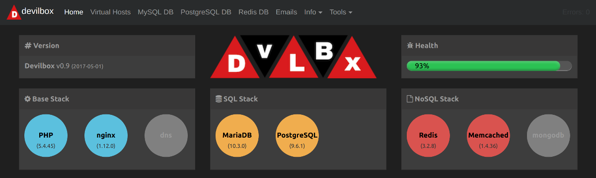
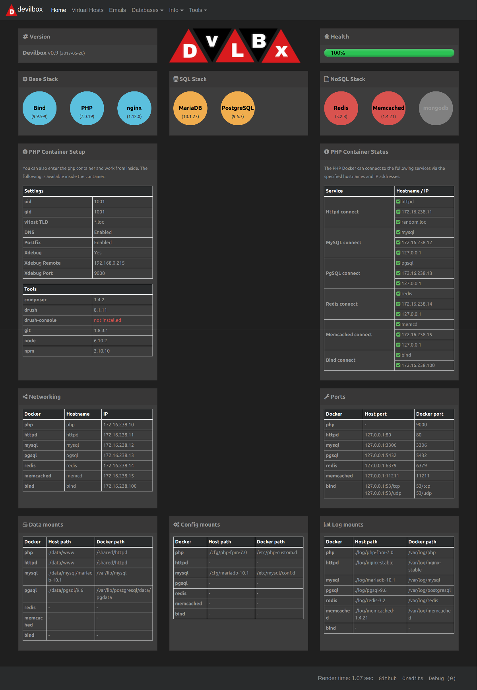
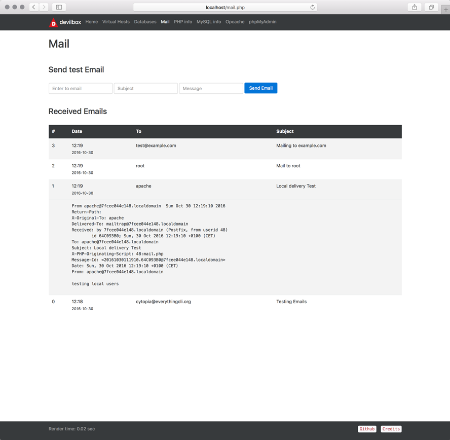

#  The devilbox


[Usage](#usage) |
[Features](#feature-overview) |
[Documentation](#documentation) |
[Run-time Matrix](#run-time-matrix) |
[Intranet](#intranet-overview) |
[Screenshots](#screenshots) |
[Contributing](#contributing) |
[License](#license)



[](https://travis-ci.org/cytopia/devilbox)  [](https://www.docker.com/) [](https://opensource.org/licenses/MIT)

The devilbox is a modern and highly customisable **LAMP** and **MEAN** stack replacement based purely on docker and docker-compose running on all major platforms. It supports an unlimited number of projects for which vhosts and DNS records are created automatically. Email catch-all and popular development tools will be at your service as well.

Configuration is not necessary, as everything is pre-setup with mass virtual hosting and also offers Auto-DNS.

**Supported operating systems**

  

<sub>It might run on FreeBSD, but I don't know the status of docker-compose there.</sub>


---


## Usage

#### Quick start

You are up and running in three simple steps:

```shell
# Create docker-compose environment file
$ cp env-example .env

# Edit your configuration
$ vim .env

# Start all containers
$ docker-compose up
```

#### Selective start

The above will start all containers, you can however also just start the containers you actually need. This is achieved by simply specifying them in the docker-compose command.

```shell
$ docker-compose up httpd php mysql redis
```


#### Run different versions

Every single attachable container comes with many different versions. In order to select the desired version for a container, simply edit the `.env` file and uncomment the version of choice.

<table>
  <thead>
    <tr>
      <th>Apache</th>
      <th>Nginx</th>
      <th>PHP</th>
      <th>MySQL</th>
      <th>MariaDB</th>
      <th>Percona</th>
      <th>PgSQL</th>
      <th>Redis</th>
      <th>Memcached</th>
      <th>MongoDB</th>
    </tr>
  </thead>
  <tbody>
    <tr>
      <td><a target="_blank" title="Apache 2.2"       href="https://github.com/cytopia/docker-apache-2.2">2.2</a></td>
      <td><a target="_blank" title="Nginx stable"     href="https://github.com/cytopia/docker-nginx-stable">stable</a></td>
      <td><a target="_blank" title="PHP 5.4"          href="https://github.com/cytopia/docker-php-fpm-5.4">5.4</a></td>
      <td><a target="_blank" title="MySQL 5.5"        href="https://github.com/cytopia/docker-mysql-5.5">5.5</a></td>
      <td><a target="_blank" title="MariaDB 5.5"      href="https://github.com/cytopia/docker-mariadb-5.5">5.5</a></td>
      <td><a target="_blank" title="PerconaDB 5.5"    href="https://github.com/cytopia/docker-percona-5.5">5.5</a></td>
      <td><a target="_blank" title="PgSQL 9.1"        href="https://github.com/docker-library/postgres">9.1</a></td>
      <td><a target="_blank" title="Redis 2.8"        href="https://github.com/docker-library/redis">2.8</a></td>
      <td><a target="_blank" title="Memcached 1.4.21" href="https://github.com/docker-library/memcached">1.4.21</a></td>
      <td><a target="_blank" title="MongoDB 2.8"      href="https://github.com/docker-library/mongo">2.8</a></td>
    </tr>
    <tr>
      <td><a target="_blank" title="Apache 2.4"       href="https://github.com/cytopia/docker-apache-2.4">2.4</a></td>
      <td><a target="_blank" title="Nginx mainline"   href="https://github.com/cytopia/docker-nginx-mainline">mainline</a></td>
      <td><a target="_blank" title="PHP 5.5"          href="https://github.com/cytopia/docker-php-fpm-5.5">5.5</a></td>
      <td><a target="_blank" title="MySQL 5.6"        href="https://github.com/cytopia/docker-mysql-5.6">5.6</a></td>
      <td><a target="_blank" title="MariaDB 10.0"     href="https://github.com/cytopia/docker-mariadb-10.0">10.0</a></td>
      <td><a target="_blank" title="PerconaDB 5.6"    href="https://github.com/cytopia/docker-percona-5.6">5.6</a></td>
      <td><a target="_blank" title="PgSQL 9.2"        href="https://github.com/docker-library/postgres">9.2</a></td>
      <td><a target="_blank" title="Redis 3.0"        href="https://github.com/docker-library/redis">3.0</a></td>
      <td><a target="_blank" title="Memcached 1.4.22" href="https://github.com/docker-library/memcached">1.4.22</a></td>
      <td><a target="_blank" title="MongoDB 3.0"      href="https://github.com/docker-library/mongo">3.0</a></td>
    </tr>
    <tr>
      <td></td>
      <td></td>
      <td><a target="_blank" title="PHP 5.6"          href="https://github.com/cytopia/docker-php-fpm-5.6">5.6</a></td>
      <td><a target="_blank" title="MySQL 5.7"        href="https://github.com/cytopia/docker-mysql-5.7">5.7</a></td>
      <td><a target="_blank" title="MariaDB 10.1"     href="https://github.com/cytopia/docker-mariadb-10.1">10.1</a></td>
      <td><a target="_blank" title="PerconaDB 5.7"    href="https://github.com/cytopia/docker-percona-5.7">5.7</a></td>
      <td><a target="_blank" title="PgSQL 9.3"        href="https://github.com/docker-library/postgres">9.3</a></td>
      <td><a target="_blank" title="Redis 3.2"        href="https://github.com/docker-library/redis">3.2</a></td>
      <td><a target="_blank" title="Memcached 1.4.23" href="https://github.com/docker-library/memcached">1.4.23</a></td>
      <td><a target="_blank" title="MongoDB 3.2"      href="https://github.com/docker-library/mongo">3.2</a></td>
    </tr>
    <tr>
      <td></td>
      <td></td>
      <td><a target="_blank" title="PHP 7.0"          href="https://github.com/cytopia/docker-php-fpm-7.0">7.0</a></td>
      <td><a target="_blank" title="MySQL 8.0"        href="https://github.com/cytopia/docker-mysql-8.0">8.0</a></td>
      <td><a target="_blank" title="MariaDB 10.2"     href="https://github.com/cytopia/docker-mariadb-10.2">10.2</a></td>
      <td></td>
      <td><a target="_blank" title="PgSQL 9.4"        href="https://github.com/docker-library/postgres">9.4</a></td>
      <td></td>
      <td><a target="_blank" title="Memcached 1.4.23" href="https://github.com/docker-library/memcached">1.4.24</a></td>
      <td><a target="_blank" title="MongoDB 3.4"      href="https://github.com/docker-library/mongo">3.4</a></td>
    </tr>
    <tr>
      <td></td>
      <td></td>
      <td><a target="_blank" title="PHP 7.1"          href="https://github.com/cytopia/docker-php-fpm-7.1">7.1</a></td>
      <td></td>
      <td><a target="_blank" title="MariaDB 10.3"     href="https://github.com/cytopia/docker-mariadb-10.3">10.3</a></td>
      <td></td>
      <td><a target="_blank" title="PgSQL 9.5"        href="https://github.com/docker-library/postgres">9.5</a></td>
      <td></td>
      <td>...</td>
      <td><a target="_blank" title="MongoDB 3.5"      href="https://github.com/docker-library/mongo">3.5</a></td>
    </tr>
    <tr>
      <td></td>
      <td></td>
      <td><a target="_blank" title="PHP 7.2"          href="https://github.com/cytopia/docker-php-fpm-7.2">7.2</a></td>
      <td></td>
      <td></td>
      <td></td>
      <td><a target="_blank" title="PgSQL 9.6"        href="https://github.com/docker-library/postgres">9.6</a></td>
      <td></td>
      <td><a target="_blank" title="Memcached latest" href="https://github.com/docker-library/memcached">1.4.36</a></td>
      <td></td>
    </tr>
    <tr>
      <td></td>
      <td></td>
      <td><a target="_blank" title="HHVM"             href="https://github.com/cytopia/docker-hhvm-latest">HHVM</a></td>
      <td></td>
      <td></td>
      <td></td>
      <td></td>
      <td></td>
      <td><a target="_blank" title="Memcached latest" href="https://github.com/docker-library/memcached">latest</a></td>
      <td></td>
    </tr>
  </tbody>
</table>

#### Enter the container

You can also work directly inside the php container. Simply use the bundled scripts `bash.sh` or `root_bash.sh`. The `PS1` will automatically be populated with current chosen php version.
```shell
# Enter as user devilbox (normal operation / development)
host> ./bash.sh
devilbox@php-7.0.19 in /shared/httpd $
```
```shell
# Enter as root user (do root stuff)
host> ./root_bash.sh
root@php-7.0.19 in /shared/httpd $
```

Your projects can be found in `/shared/httpd`. DNS records are automatically available inside the php container. Also every other service will be available on `127.0.0.1` inside the php container (tricky socat port-forwarding).


## Feature overview

The devilbox has everything setup for you. The only thing you will have to install is `docker` and `docker-compose`. Virtual hosts and DNS entries will be created automatically, just by adding new project folders.

#### Features

* **Mass virtual host**
* **Custom domains** (`*.loc`, `*.local`, `*.dev`, `*.sub.loc`, ...)
* **Auto-DNS** (Internal Bind server running)
* **Email catch-all** (Internal postfix with catch-all)
* **Log files** (available on host computer)
* **Config overwrites** (`my.cnf`, `nginx.conf`, `httpd.conf` or `php.ini`)
* **Self-validation** (projects and configured options are validated and marked in the intranet)
* **Xdebug**

#### Batteries

* [phpMyAdmin](https://www.phpmyadmin.net)
* [Adminer](https://www.adminer.org)
* [OpcacheGUI](https://github.com/PeeHaa/OpCacheGUI)
* Mail viewer

#### Tools

| tool           | binary |
|----------------|---------|
| [composer](https://getcomposer.org)    | `composer` |
| [drupal-console](https://drupalconsole.com) | `drupal` |
| [drush](http://www.drush.org)          | `drush` |
| [git](https://git-scm.com)             | `git` |
| [laravel installer](https://github.com/laravel/installer)     | `laravel` |
| [mysqldump-secure](https://mysqldump-secure.org) | `mysqldump-secure` |
| [node](https://nodejs.org)             | `node` |
| [npm](https://www.npmjs.com)           | `npm` |
| [phalcon-devtools](https://github.com/phalcon/phalcon-devtools)   | `phalcon` |
| [symfony installer](https://github.com/symfony/symfony-installer) | `symfony` |
| [wp-cli](https://wp-cli.org)           | `wp` |

Require additional tools? Have a look at [Hacking](docs/Hacking.md) for information about how to add your own tools or open up an issue with a new tool request.

#### PHP Modules

The devilbox is a development stack, so it is made sure that a lot of PHP modules are available out of the box in order to work with many different frameworks.

> *apc, apcu, bcmath, bz2, calendar, Core, ctype, curl, date, dom, ereg, exif, fileinfo, filter, ftp, gd, gettext, gmp, hash, iconv, igbinary, imagick, imap, intl, json, ldap, libxml, magickwand, mbstring, mcrypt, memcache, memcached, mhash, mongodb, msgpack, mysql, mysqli, mysqlnd, openssl, pcntl, pcre, PDO, pdo_mysql, pdo_pgsql, pdo_sqlite, pgsql, phalcon, Phar, posix, pspell, readline, recode, redis, Reflection, session, shmop, SimpleXML, soap, sockets, SPL, sqlite3, standard, sysvmsg, sysvsem, sysvshm, tidy, tokenizer, uploadprogress, wddx, xdebug, xml, xmlreader, xmlrpc, xmlwriter, xsl, Zend OPcache, zip, zlib*

#### Supported Frameworks

As far as tested there are no limitations and you can use any Framework or CMS just as you would on your live environment. Below are a few examples of extensively tested Frameworks and CMS:

[](https://cakephp.org)
[](https://www.drupal.org)
[](https://laravel.com)
[](https://phalconphp.com)
[](https://symfony.com)
[](https://wordpress.org)
[](http://www.yiiframework.com)
[](https://framework.zend.com)


## Documentation

#### Video Tutorials

To get you started quickly, lean back and watch the following videos on Youtube.

[](https://www.youtube.com/watch?v=reyZMyt2Zzo) 
[](https://www.youtube.com/watch?v=e-U-C5WhxGY)

#### Documentation explained

The devilbox documentation consists of the following main sections.

| Documentaion                     | Description |
|----------------------------------|-------------|
| [Overview](docs/README.md)       | General overview |
| [Quickstart](docs/Quickstart.md) | Everything needed to get you started in no time |
| [Install](docs/Install.md)       | Installation information for different operating systems |
| [Update](docs/Update.md)         | Update strategies |
| [Configure](docs/Configure.md)   | How to configure the devilbox and its services |
| [Run](docs/Run.md)               | Explanation of different required docker-compose run commands |
| [Usage](docs/Usage.md)           | How to use the devilbox in detail |
| [OS](docs/OS.md)                 | Operating system specific information |
| [Backups](docs/Backups.md)       | How to backup and restore various databases |
| [Examples](docs/Examples.md)     | How to setup different frameworks: drupal, Yii, Symfony, Phalcon, Wordpress... |
| [Technical](docs/Technical.md)   | Technical background information |
| [Hacking](docs/Hacking.md)       | Hack the devilbox and integrate custom stuff |
| [FAQ](docs/FAQ.md)               | Frequently asked questions |

#### Documentation

1. **[Overview](docs/README.md)**
    1. [Main idea](docs/README.md#1-main-idea)
    2. [Features](docs/README.md#2-features)
    3. [Supported Host OS](docs/README.md#3-supported-host-os)
    4. [Requirements](docs/README.md#4-requirements)
    5. [Docker documentation](docs/README.md#5-docker-documentation)
    6. [Devilbox documentation](docs/README.md#6-devilbox-documentation)
    7. [Video Tutorials](docs/README.md#7-video-tutorials)
    8. [Available PHP Modules](docs/README.md#8-available-php-modules)
    9. [Supported Frameworks and CMS](docs/README.md#9-supported-frameworks-and-cms)
2. **[Quickstart](docs/Quickstart.md)**
    1. [Installation](docs/Quickstart.md#1-installation)
    2. [Update](docs/Quickstart.md#2-update)
    3. [Configuration](docs/Quickstart.md#3-configuration)
    4. [Run](docs/Quickstart.md#4-run)
    5. [Project setup](docs/Quickstart.md#5-project-setup)
    6. [Enter the PHP Docker container](docs/Quickstart.md#6-enter-the-php-docker-container)
3. **[Install](docs/Install.md)**
    1. [Install Docker](docs/Install.md#1-install-docker)
        1. [Linux](docs/Install.md#1-1-linux)
        2. [Windows](docs/Install.md#1-2-windows)
        3. [OSX](docs/Install.md#1-3-osx)
    2. [Install Devilbox](#2-install-devilbox)
4. **[Update](docs/Update.md)**
    1. [TL;DR](docs/Update.md#1-tl-dr)
    2. [Git tag vs master branch](docs/Update.md#2-git-tag-vs-master-branch)
    3. [Compare .env file](docs/Update.md#3-compare-env-file)
    4. [Pull new Docker container (Important!)](docs/Update.md#4-pull-new-docker-container-important-)
    5. [Remove anonymous volumes](docs/Update.md#5-remove-anonymous-volumes)
5. **[Configure](docs/Configure.md)**
    1. [Overview](docs/Configure.md#1-overview)
    2. [Devilbox general settings](docs/Configure.md#2-devilbox-general-settings)
    3. [Project settings](docs/Configure.md#3-project-settings)
    4. [Container settings](docs/Configure.md#4-container-settings)
    5. [Intranet settings](docs/Configure.md#5-intranet-settings)
    6. [Host computer](docs/Configure.md#6-host-computer)
6. **[Run](docs/Run.md)**
    1. [Start the devilbox](docs/Run.md#1-start-the-devilbox)
    2. [Stop the devilbox](docs/Run.md#2-stop-the-devilbox)
    3. [Attach/Detach during run-time](docs/Run.md#3-attach-detach-during-run-time)
    4. [Docker logs](docs/Run.md#4-docker-logs)
7. **[Usage](docs/Usage.md)**
    1. [Mounted directories](docs/Usage.md#1-mounted-directories)
    2. [Work on the Docker host](docs/Usage.md#2-work-on-the-docker-host)
    3. [Work inside the PHP container](docs/Usage.md#3-work-inside-the-php-container)
    4. [Managing Projects explained](docs/Usage.md#4-managing-projects-explained)
    5. [Creating new Projects](docs/Usage.md#5-creating-new-projetcs)
    6. [Switching container versions](docs/Usage.md#6-switching-container-versions)
    7. [Emails](docs/Usage.md#7-emails)
    8. [Log files](docs/Usage.md#8-log-files)
    9. [Intranet](docs/Usage.md#9-intranet)
8. **[OS](docs/OS.md)**
    1. [Linux](docs/OS.md#1-linux)
    2. [Windows](docs/OS.md#2-windows)
    3. [OSX](docs/OS.md#3-osx)
9. **[Backups](docs/Backups.md)**
    1. [Info](docs/Backups.md#1-info)
    2. [MySQL](docs/Backups.md#2-mysql)
        1. [MySQL Database Backup](docs/Backups.md#2-1-mysql-database-backup)
        2. [MySQL Database Restore](docs/Backups.md#2-2-mysql-database-restore)
    3. [PostgreSQL](docs/Backups.md#3-postgresql)
        1. [PostgreSQL Database Backup](docs/Backups.md#3-1-postgresql-database-backup)
        2. [PostgreSQL Database Restore](docs/Backups.md#3-1-postgresql-database-restore)
    4. [MongoDB](docs/Backups.md#4-mongodb)
        1. [MongoDB Database Backup](docs/Backups.md#4-1-mongodb-database-backup)
        2. [MongoDB Database Restore](docs/Backups.md#4-1-mongodb-database-restore)
10. **[Examples](docs/Examples.md)**
    1. [Introduction](docs/Examples.md#1-introduction)
    2. [Setup CakePHP](docs/Examples.md#2-setup-cakephp)
    3. [Setup Drupal](docs/Examples.md#3-setup-drupal)
    4. [Setup Laravel](docs/Examples.md#4-setup-laravel)
    5. [Setup Phalcon](docs/Examples.md#5-setup-phalcon)
    6. [Setup Symfony](docs/Examples.md#6-setup-symfony)
    7. [Setup Wordpress](docs/Examples.md#7-setup-wordpress)
    8. [Setup Yii](docs/Examples.md#8-setup-yii)
    9. [Setup Zend](docs/Examples.md#9-setup-zend)
11. **[Technical](docs/Technical.md)**
    1. [Networking](docs/Technical.md#1-networking)
    2. [Ports and forwarding](docs/Technical.md#2-ports-and-forwarding)
    3. [Works the same on Host and PHP Container](docs/Technical.md#3-works-the-same-on-host-and-php-container)
12. **[Hacking](docs/Hacking.md)**
    1. [Rebuilding bundled Docker container](docs/Hacking.md#1-rebuilding-bundled-docker-container)
    2. [Customizing the bundled Docker container](docs/Hacking.md#2-customizing-the-bundled-docker-container)
    3. [Adding your own Docker container](docs/Hacking.md#3-adding-your-own-docker-container)
13. **[FAQ](docs/FAQ.md)**


## Run-time Matrix

The main idea of the devilbox is to selectively run and combine any version you require for your currently desired development stack. Services are grouped into different stacks, currently into **Base**, **SQL** and **NoSQL**. However there are many more to come. If you find yourself in need of a stack or service that is not yet inluded, just open up an issue or pull request.

In order to make sure every combination works with each other, the devilbox integrates extensive CI tests for the Docker container itself and their combinations. The following tables show the available stacks including git repositories and travis-ci checks.

<sub>**Note:** Entries without links or without build-status are planned, but not yet available. See [ROADMAP](https://github.com/cytopia/devilbox/issues/23) for tasks and upcoming features.</sub>

#### Base stack (required)

| DNS | Webserver | PHP |
|-----|-----------|-----|
| [](https://travis-ci.org/cytopia/docker-bind) [Bind](https://github.com/cytopia/docker-bind)  | [](https://travis-ci.org/cytopia/docker-apache-2.2) [Apache 2.2](https://github.com/cytopia/docker-apache-2.2) | [](https://travis-ci.org/cytopia/docker-php-fpm-5.4) [PHP 5.4](https://github.com/cytopia/docker-php-fpm-5.4) |
|     | [](https://travis-ci.org/cytopia/docker-apache-2.4) [Apache 2.4](https://github.com/cytopia/docker-apache-2.4) | [](https://travis-ci.org/cytopia/docker-php-fpm-5.5) [PHP 5.5](https://github.com/cytopia/docker-php-fpm-5.5) |
|     | [](https://travis-ci.org/cytopia/docker-nginx-stable) [Nginx stable](https://github.com/cytopia/docker-nginx-stable) | [](https://travis-ci.org/cytopia/docker-php-fpm-5.6) [PHP 5.6](https://github.com/cytopia/docker-php-fpm-5.6) |
|     | [](https://travis-ci.org/cytopia/docker-nginx-mainline) [Nginx mainline](https://github.com/cytopia/docker-nginx-mainline) | [](https://travis-ci.org/cytopia/docker-php-fpm-7.0) [PHP 7.0](https://github.com/cytopia/docker-php-fpm-7.0) |
|     | | [](https://travis-ci.org/cytopia/docker-php-fpm-7.1) [PHP 7.1](https://github.com/cytopia/docker-php-fpm-7.1) |
|     | | [](https://travis-ci.org/cytopia/docker-php-fpm-7.2) [PHP 7.2](https://github.com/cytopia/docker-php-fpm-7.2)
|     | | [](https://travis-ci.org/cytopia/docker-hhvm-latest) [HHVM latest](https://github.com/cytopia/docker-hhvm-latest)

#### SQL stack (optional)

| MySQL | PostgreSQL | MS SQL |
|-------|------------|--------|
| [](https://travis-ci.org/cytopia/docker-mysql-5.5) [MySQL 5.5](https://github.com/cytopia/docker-mysql-5.5) | [](https://travis-ci.org/docker-library/postgres/branches) [PgSQL 9.1](https://hub.docker.com/_/postgres/) | MS SQL 2017 |
| [](https://travis-ci.org/cytopia/docker-mysql-5.6) [MySQL 5.6](https://github.com/cytopia/docker-mysql-5.6) | [](https://travis-ci.org/docker-library/postgres/branches) [PgSQL 9.2](https://hub.docker.com/_/postgres/) | |
| [](https://travis-ci.org/cytopia/docker-mysql-5.7) [MySQL 5.7](https://github.com/cytopia/docker-mysql-5.7) | [](https://travis-ci.org/docker-library/postgres/branches) [PgSQL 9.3](https://hub.docker.com/_/postgres/) | |
| [](https://travis-ci.org/cytopia/docker-mysql-8.0) [MySQL 8.0](https://github.com/cytopia/docker-mysql-8.0)  | [](https://travis-ci.org/docker-library/postgres/branches) [PgSQL 9.4](https://hub.docker.com/_/postgres/) | |
| [](https://travis-ci.org/cytopia/docker-mariadb-5.5) [MariaDB 5.5](https://github.com/cytopia/docker-mariadb-5.5) | [](https://travis-ci.org/docker-library/postgres/branches) [PgSQL 9.5](https://hub.docker.com/_/postgres/) | |
| [](https://travis-ci.org/cytopia/docker-mariadb-10.0) [MariaDB 10.0](https://github.com/cytopia/docker-mariadb-10.0) | [](https://travis-ci.org/docker-library/postgres/branches) [PgSQL 9.6](https://hub.docker.com/_/postgres/) | |
| [](https://travis-ci.org/cytopia/docker-mariadb-10.1) [MariaDB 10.1](https://github.com/cytopia/docker-mariadb-10.1) | | |
| [](https://travis-ci.org/cytopia/docker-mariadb-10.2) [MariaDB 10.2](https://github.com/cytopia/docker-mariadb-10.2) | | |
| [](https://travis-ci.org/cytopia/docker-mariadb-10.3) [MariaDB 10.3](https://github.com/cytopia/docker-mariadb-10.3) | | |
| [](https://travis-ci.org/cytopia/docker-percona-5.5) [PerconaDB 5.5](https://github.com/cytopia/docker-percona-5.5) | | |
| [](https://travis-ci.org/cytopia/docker-percona-5.6) [PerconaDB 5.6](https://github.com/cytopia/docker-percona-5.6) | | |
| [](https://travis-ci.org/cytopia/docker-percona-5.7) [PerconaDB 5.7](https://github.com/cytopia/docker-percona-5.7) | | |

#### NoSQL stack (optional)

| Cassandra | CouchDB | Memcached | MongoDB | Redis |
|-----------|---------|-----------|---------|-------|
| Cassandra 2.1 | CouchDB 1.6 | [](https://travis-ci.org/docker-library/memcached) [latest](https://github.com/docker-library/memcached) | [](https://travis-ci.org/docker-library/mongo) [2.8](https://github.com/docker-library/mongo) | [](https://travis-ci.org/docker-library/redis) [2.8](https://github.com/docker-library/redis) |
| Cassandra 2.2 | CouchDB 2.0 |                  | [](https://travis-ci.org/docker-library/mongo) [3.0](https://github.com/docker-library/mongo) | [](https://travis-ci.org/docker-library/redis) [3.0](https://github.com/docker-library/redis) |
| Cassandra 3.0 |             |                  | [](https://travis-ci.org/docker-library/mongo) [3.2](https://github.com/docker-library/mongo) | [](https://travis-ci.org/docker-library/redis) [3.2](https://github.com/docker-library/redis) |
|               |             |                  | [](https://travis-ci.org/docker-library/mongo) [3.4](https://github.com/docker-library/mongo) | |
| | | | [](https://travis-ci.org/docker-library/mongo) [3.5](https://github.com/docker-library/mongo) | |

<!--
#### Message stack (optional)
**Optional search stack**

| Apache Solr | Elasticsearch |
|-------------|---------------|
| todo        |               |
-->
<!--
**Optional cgi stack**

| Go   | Perl | Python | Ruby |
|------|------|--------|------|
| todo | todo | todo   | todo |
-->


## Intranet overview

The devilbox comes with a pre-configured intranet on `http://localhost`. It will not only show you, your chosen configuration, but also validate the status of your configuration, such as *Do DNS records exists (on host and container)*, *are directories properly set-up*. Additionally it provides external tools to let you interact with databases and emails.

* **Virtual Host overview** (validates directories and DNS)
* **Database overview** (MySQL, PgSQL, Redis, Memcache, ...)
* **Email overview**
* **Info pages** (Httpd, MySQL, PgSQL, Redis, Memcache, ...)
* **[phpMyAdmin](https://www.phpmyadmin.net)**
* **[Adminer](https://www.adminer.org)**
* **[OpcacheGUI](https://github.com/PeeHaa/OpCacheGUI)**


## Screenshots

#### Homepage with host / docker information

The homepage shows you the status of your current configured setup.

* which versions are used
* what directories are mounted
* where does DNS point to
* what other settings have been set
* did any errors occur?



#### Virtual Host overview

This overview shows you all available virtual hosts and if they need additional configuration (on the host)

Virtual Hosts are considered valid if the following requirements are met (on the host system):

* `htdocs` folder/symlink exists in your project folder
* `/etc/hosts` has a valid DNS config for your host: `127.0.0.1  <project-folder>.<TLD_SUFFIX>` (alternatively the bundle BIND server can be attached to your host-computer).


#### Database overview

Shows you all the databases that are loaded


#### Email overview

Shows you all the emails that have been sent. No email will actually be sent outside, but they are all catched by one account and presented here.




## Contributing

Contributers are welcome in any way.

First of all, if you like the project, please **do star it**. Starring is an important measurement to see the number of active users and better allows me to organize my time and effort I can put into this project.

Secondly, please **do report all bugs**. This will not only help you get your problem fixed, but also help others as they might encounter the same.

And last but not least, you can also get actively involved. **Do clone the project** and start improving whatever you think is useful. There is quite a lot todo and planned. If you like to contribute, view [CONTRIBUTING.md](CONTRIBUTING.md) and [ROADMAP](https://github.com/cytopia/devilbox/issues/23).

Major contributors will be credited within the intranet and on the github page.


## License

[MIT License](LICENSE.md)
