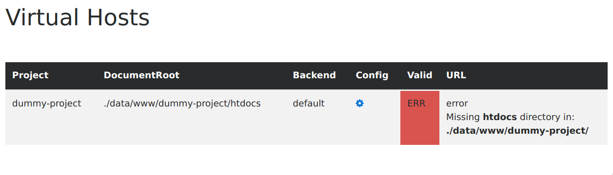
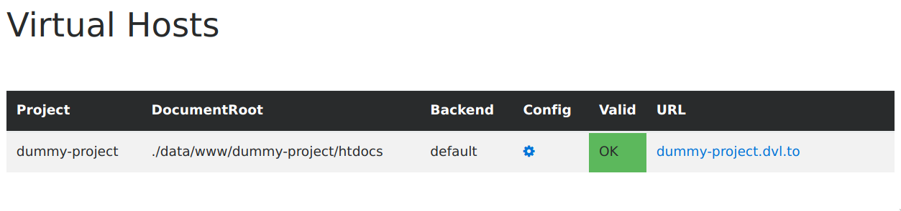
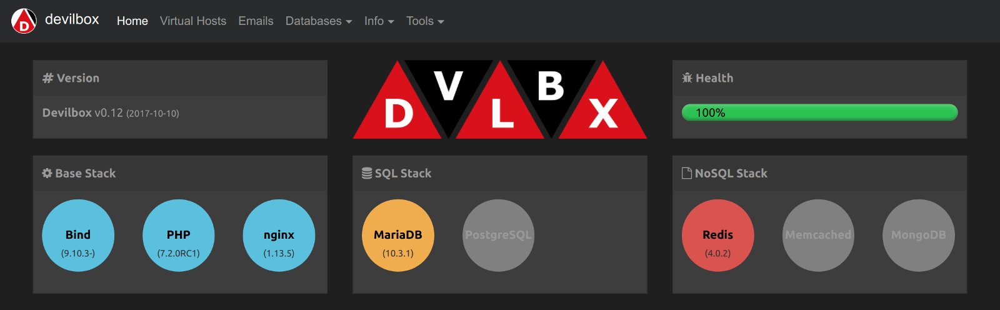
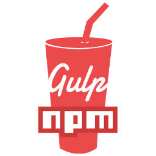

<p align="center">
    <h1 align="center">The Devilbox</h1>
</p>


**[Quickstart](#-quickstart)** |
**[Examples](#-examples)** |
**[Features](#star-features)** |
**[The Devilbox Stack](#-the-devilbox-stack)** |
**[Community](#-community)** |
**[Contributing](#-contributing)** |
**[Logos](#-logos)** |
**[License](#-license)**


[](https://github.com/cytopia/devilbox/releases)
[](https://discord.gg/2wP3V6kBj4)
[](https://devilbox.discourse.group)
[](https://opensource.org/licenses/MIT)

<!--
[](https://devilbox.readthedocs.io)
[](https://github.com/cytopia/devilbox/actions?workflow=Lint)
[](https://github.com/cytopia/devilbox/actions?workflow=Docs)

[](https://github.com/cytopia/devilbox/actions/workflows/test-php.yml)
[](https://github.com/cytopia/devilbox/actions/workflows/test-httpd.yml)
[](https://github.com/cytopia/devilbox/actions/workflows/test-mysql.yml)
[](https://github.com/cytopia/devilbox/actions/workflows/test-memcd.yml)
[](https://github.com/cytopia/devilbox/actions/workflows/test-mongo.yml)
[](https://github.com/cytopia/devilbox/actions/workflows/test-pgsql.yml)
[](https://github.com/cytopia/devilbox/actions/workflows/test-redis.yml)
-->

<!--
<br/>
<small><sub>Support for <a href="https://devilbox.readthedocs.io/en/latest/intermediate/setup-valid-https.html">valid https</a> out of the box.</sub></small>
-->

The Devilbox is a versatile and highly customisable zero-conf PHP Docker stack supporting LEMP and MEAN as well as Websockets, Node, Python and Golang via automated Reverse Proxy integraton.
<br/>
<br/>
The main goal is to provide a reproducible development environment that runs on all major platforms and is able to switch and combine any version you need.
It supports an unlimited number of projects for which vhosts, SSL certificates and DNS records are created automatically.
Email interception and popular development tools will be at your service as well. Configuration is not necessary, as everything is already pre-setup.
<br/>
<br/>
All created projects (frontend or backend) will be able to communicate with one another to support the emulation of a complete microservice architecture or an API landscape.
<br/>
<br/>
**Available Architectures:** `amd64`, `arm64`<br/>
**Available PHP Versions:** `5.2`, `5.3`, `5.4`, `5.5`, `5.6`, `7.0`, `7.1`, `7.2`, `7.3`, `7.4`, `8.0`, `8.1`, `8.2`


## 🚀 Quickstart

<details><summary>❗ System Requirements</summary>
<br/>
The Devilbox runs on all major operating systems and its only requirement is <code>Docker</code> and <code>Docker Compose</code>:<br/><br/>


<br/>

* [Docker Engine 17.06.0+](https://docs.docker.com/compose/compose-file/compose-versioning/#version-23)
* [Docker Compose 1.16.0+](https://docs.docker.com/compose/compose-file/compose-versioning/#version-23)
</details>

**Be up and running in 2 minutes.**

<details style="margin-bottom:0px;"><summary>🚀 Install and Run: Linux</summary>

<h3>Linux: Install</h3>

1. Download the Devilbox
   ```bash
   git clone https://github.com/cytopia/devilbox
   ```
2. Enter the Devilbox git directory
   ```bash
   cd devilbox
   ```
3. Copy the default environment file
   ```bash
   cp env-example .env
   ```

<h3>Linux: Run</h3>

> <strong>:warning: Important: </strong> Ensure that nothing is listening on port <code>80</code> and <code>443</code> on your host system. These ports are required by the Devilbox webserver.

<br/>

1. Start `httpd`, `php` and `mysql` container
   ```bash
   # This step may take a few minutes as required
   # Docker images have to be pulled initially.

   # Inside the Devilbox git directory
   docker-compose up httpd php mysql
   ```
2. Visit http://localhost in your browser

<br/>
</details>


<details style="margin-bottom:0px;"><summary>🚀 Install and Run: MacOS</summary>

<h3>MacOS: Install</h3>

1. Download the Devilbox
   ```bash
   git clone https://github.com/cytopia/devilbox
   ```
2. Enter the Devilbox git directory
   ```bash
   cd devilbox
   ```
3. Copy the default environment file
   ```bash
   cp env-example .env
   ```

<h3>MacOS: Run</h3>

> <strong>:warning: Important: </strong> Ensure that nothing is listening on port <code>80</code> and <code>443</code> on your host system. These ports are required by the Devilbox webserver.

<br/>

1. Start `httpd`, `php` and `mysql` container
   ```bash
   # This step may take a few minutes as required
   # Docker images have to be pulled initially.

   # Inside the Devilbox git directory
   docker-compose up httpd php mysql
   ```
2. Visit http://localhost in your browser

<br/>
</details>


<details style="margin-bottom:0px;"><summary>🚀 Install and Run: Windows</summary>
<br/>
<strong>Note: </strong> If you are using <code>WSL2</code>, refer to the Linux guide instead.
<br/>

<h3>Windows: Install</h3>

1. Clone <code>https://github.com/cytopia/devilbox</code> to <code>C:\devilbox</code> with <a href="https://git-scm.com/downloads">Git for Windows</a>
2. Copy <code>C:\devilbox\env-example</code> to <code>C:\devilbox\.env</code>


<h3>Windows: Run</h3>

> <strong>:warning: Important: </strong> Ensure that nothing is listening on port <code>80</code> and <code>443</code> on your host system. These ports are required by the Devilbox webserver.

<a href="https://devilbox.readthedocs.io/en/latest/howto/terminal/open-terminal-on-win.html">Open a terminal on Windows</a> and start `httpd`, `php` and `mysql` container:
<br/>

1. Start `httpd`, `php` and `mysql` container
   ```bash
   # This step may take a few minutes as required
   # Docker images have to be pulled initially.

   # Inside the Devilbox git directory
   docker-compose up httpd php mysql
   ```
2. Visit http://localhost in your browser

<br/>
</details>


<details><summary>💻 Enter the work container</summary>
<h3>Enter the work container</h3>

The Devilbox allows you to work on your projects on the host system as well as inside the work container. Your project files will be available at both locations. The workflow ususally is:

1. Use your prefered IDE (e.g. PhpStorm) on your host system to add and alter files
2. Work inside the container to run common cli tools such as `node`, `composer`, `npm`, `phpcs`, `webpack` and many more.

To enter the work container, simply run `./shell.sh`

1. On Linux, MacOS and Windows with WSL2
   ```bash
   # Inside the Devilbox git directory
   ./shell.sh
   ```
2. On Windows without WSL2
   ```bash
   # Inside the Devilbox git directory
   ./shell.bat
   ```

</details>


## 💡 Examples

**Create your first project:**

<details><summary>Example: Dummy Project</summary>

1. Start the container you need:
   ```bash
   docker-compose up httpd php mysql
   ```
2. Enter the work container:
   ```bash
   ./shell.sh
   ```
3. Navigate to `/shared/httpd`:
   ```bash
   cd /shared/httpd
   ```
4. Create your project directory
   ```bash
   mkdir dummy-project
   ```
5. Visit http://localhost/vhosts.php<br/>
   You will notice that you need to create a `htdocs/` directory<br/>
   
6. Create `htdocs/` directory
   ```bash
   # Navigate to your project directory
   cd /shared/httpd/dummy-project

   # Create htdocs dir
   mkdir htdocs
   ```
7. Visit http://localhost/vhosts.php<br/>
   You will see that everything is now setup and your project is created and available<br/>
   
8. Create an `index.php` file
   ```bash
   # Navigate to your project htdocs directory
   cd /shared/httpd/dummy-project/htdocs

   # Create a simple index.php file
   echo '<?php echo "it works";' > index.php
   ```
9. View your project in the browser: http://dummy-project.dvl.to

<br/>
</details>


<details><summary>Example: PHP Framework</summary>

Find all the examples in the documentation:

<a target="_blank" title="How to Setup CakePHP on the Devilbox" href="https://devilbox.readthedocs.io/en/latest/examples/setup-cakephp.html"></a>
<a target="_blank" title="How to Setup CodeIgniter on the Devilbox" href="https://devilbox.readthedocs.io/en/latest/examples/setup-codeigniter.html"></a>
<a target="_blank" title="How to Setup Contao on the Devilbox" href="https://devilbox.readthedocs.io/en/latest/examples/setup-contao.html"></a>
<a target="_blank" title="How to Setup CraftCMS on the Devilbox" href="https://devilbox.readthedocs.io/en/latest/examples/setup-craftcms.html"></a>
<a target="_blank" title="How to Setup Drupal on the Devilbox" href="https://devilbox.readthedocs.io/en/latest/examples/setup-drupal.html"></a>
<a target="_blank" title="How to Setup Joomla on the Devilbox" href="https://devilbox.readthedocs.io/en/latest/examples/setup-joomla.html"></a>
<a target="_blank" title="How to Setup Laravel on the Devilbox" href="https://devilbox.readthedocs.io/en/latest/examples/setup-laravel.html"></a>
<a target="_blank" title="How to Setup Magento 2 on the Devilbox" href="https://devilbox.readthedocs.io/en/latest/examples/setup-magento2.html"></a>
<a target="_blank" title="How to Setup PhalconPHP on the Devilbox" href="https://devilbox.readthedocs.io/en/latest/examples/setup-phalcon.html"></a>
<a target="_blank" title="How to Setup PhotonCMS on the Devilbox" href="https://devilbox.readthedocs.io/en/latest/examples/setup-photon-cms.html"></a>
<a target="_blank" title="How to Setup PrestaShop on the Devilbox" href="https://devilbox.readthedocs.io/en/latest/examples/setup-presta-shop.html"></a>
<a target="_blank" title="How to Setup ProcessWire on the Devilbox" href="https://devilbox.readthedocs.io/en/latest/examples/setup-processwire.html"></a>
<a target="_blank" title="How to Setup Shopware on the Devilbox" href="https://devilbox.readthedocs.io/en/latest/examples/setup-shopware.html"></a>
<a target="_blank" title="How to Setup Symfony on the Devilbox" href="https://devilbox.readthedocs.io/en/latest/examples/setup-symfony.html"></a>
<a target="_blank" title="How to Setup Typo3 on the Devilbox" href="https://devilbox.readthedocs.io/en/latest/examples/setup-typo3.html"></a>
<a target="_blank" title="How to Setup WordPress on the Devilbox" href="https://devilbox.readthedocs.io/en/latest/examples/setup-wordpress.html"></a>
<a target="_blank" title="How to Setup Yii on the Devilbox" href="https://devilbox.readthedocs.io/en/latest/examples/setup-yii.html"></a>
<a target="_blank" title="How to Setup Zend on the Devilbox" href="https://devilbox.readthedocs.io/en/latest/examples/setup-zend.html"></a>
</details>


## :star: Features

The Devilbox tries to be a zero-configuration stack out of the box and has automated all the boring tasks. Additionally it provides common feature required for everyday work.

<table>
 <tr valign="top" style="vertical-align:top">
  <td>
   <strong>Automation</strong><br/>
   :star: <code>Automated Project creation</code><br/>
   :star: <code>Automated SSL</code><br/>
   :star: <code>Automated DNS</code><br/>
   :star: <code>Host permission sync</code><br/>
  </td>
  <td>
   <strong>Modes</strong><br/>
   :star: <code>Static files</code><br/>
   :star: <code>PHP files</code><br/>
   :star: <code>Reverse Proxy</code><br/>
   :star: <code>Websockets</code><br/>
  </td>
  <td>
   <strong>Backends</strong><br/>
   :star: <code>PHP-FPM</code><br/>
   :star: <code>NodeJS</code><br/>
   :star: <code>Python</code><br/>
   :star: <code>Golang</code><br/>
   :star: <code>...</code><br/>
  </td>
  <td>
   <strong>Profiling</strong><br/>
   :star: <code>Blackfire</code><br/>
   :star: <code>Xdebug</code><br/>
   :star: <code>XHProf</code><br/>
  </td>
 </tr>
 <tr valign="top" style="vertical-align:top">
  <td>
   <strong>Projects</strong><br/>
   :star: <code>Unlimited Projects</code><br/>
   :star: <code>Inter-Project Communication</code><br/>
   :star: <code>Custom Project domains</code><br/>
   :star: <code>Valid browser HTTPS</code><br/>
  </td>
  <td>
   <strong>Intranet</strong><br/>
   :star: <code>Virtual Hosts</code><br/>
   :star: <code>C&C</code><br/>
   :star: <code>Email Reader</code><br/>
   :star: <code>OpCache Gui</code><br/>
  </td>
  <td>
   <strong>Batteries</strong><br/>
   :star: <code>Adminer</code><br/>
   :star: <code>phpMyAdmin</code><br/>
   :star: <code>phpPgAdmin</code><br/>
   :star: <code>phpRedMind</code><br/>
  </td>
  <td>
   <strong>Services</strong><br/>
   :star: <code>SQL</code><br/>
   :star: <code>NoSQL</code><br/>
   :star: <code>Cache</code><br/>
   :star: <code>...</code><br/>
  </td>
 </tr>
</table>


<h2> The Devilbox Stack</h2>

The Devilbox aims to be a swiss army knife for local development by providing you all the services you would ever need. To get an idea about the architecture behind it and to also see what's available have a look at its components and usage.

<table width="100%" style="width:100%;display:table">
 <tr>
  <td width="30%" valign="top" style="width:30%; vertical-align:top;">
   <h4>Smallest stack</h4>
   <p>This is the smallest possible and fully functional stack you can run</p>
  </td>
  <td width="70%" valign="top" style="width:70%; vertical-align:top;">
   <h4>Full stack</h4>
   <p>To better understand what is actually possible have a look at the full example</p>
  </td>
 </tr>
 <tr>
  <td>
   
  </td>
  <td>
   
  </td>
 </tr>
</table>


<details style="margin-bottom: 0px;"><summary><strong>💻 Modes of operation</strong></summary>

<h3>Modes of operation</h3>

You can startup and operate the Devilbox in three different ways via `docker-compose`:

1. Selective startup
2. On Demand (add/remove container while running)
3. Full startup

#### Selective startup

If you already know what kind of container you need before starting the Devilbox, you can just specify them explicitly.

```bash
# Inside the Devilbox git directory start httpd php mysql and redis
docker-compose up httpd php mysql redis
```

The Intranet will show you what container you have currently running:




#### On Demand

If the Devilbox is already started you can attach more container on-the-fly,

```bash
# Inside the Devilbox git directory attach mongo and memcached
docker-compose up mongo memcd
```

You can also shut down specific containers that you do not need

```bash
# Inside the Devilbox git directory shutdown redis
docker-compose stop redis
```

#### Full startup

If you just want to start everything, run `docker-compose up` without any arguments

```bash
# Inside the Devilbox git directory start them all
docker-compose up
```

The Intranet will show you what container you have currently running:


If you prefer a visual guide, have a look at the two introduction videos on Youtube:
<br/>
<br/>
<a target="_blank" title="Devilbox - Setup and Workflow" href="https://www.youtube.com/watch?v=reyZMyt2Zzo"></a>
<a target="_blank" title="Devilbox - Email Interception" href="https://www.youtube.com/watch?v=e-U-C5WhxGY"></a>

> **Documentation:**
> [Install the Devilbox](https://devilbox.readthedocs.io/en/latest/getting-started/install-the-devilbox.html) |
> [Start the Devilbox](https://devilbox.readthedocs.io/en/latest/getting-started/start-the-devilbox.html) |
> [.env file](https://devilbox.readthedocs.io/en/latest/configuration-files/env-file.html)

<br/>
</details>


<details style="margin-bottom: 0px;"><summary><strong>🐋 Available Container</strong></summary>

<h3>Available Container</h3>

The following table lists all integrated and pre-configured Docker container shipped by the Devilbox.
Only the webserver and PHP container are mandatory, all others are optional and don't need to be started.

Each of them is also available in multiple different versions in order to reflect your exact desired environment.

| Accel   | Web        | App            | SQL        | NoSQL     | Queue / Search | ELK           | Utils     |
|---------|------------|----------------|------------|-----------|----------------|---------------|-----------|
| HAProxy | Apache     | PHP            | MariaDB    | Memcached | RabbitMQ       | ElasticSearch | Bind      |
| Varnish | Nginx      | Python (Flask) | MySQL      | MongoDB   | Solr           | Logstash      | Blackfire |
|         |            |                | PerconaDB  | Redis     |                | Kibana        | MailHog   |
|         |            |                | PostgreSQL |           |                |               | Ngrok     |

<br/>

> **Documentation:**
> [Available Container](https://devilbox.readthedocs.io/en/latest/readings/available-container.html)

<br/>
</details>


<details style="margin-bottom: 0px;"><summary><strong>📌 Version Matrix</strong></summary>

<h3>Version Matrix</h3>

Every single attachable container comes with many different versions. In order to select the desired version for a container, simply edit the `.env` file and uncomment the version of choice. Any combination is possible.

#### Run different versions

<table>
  <thead>
    <tr>
      <th>Apache</th>
      <th>Nginx</th>
      <th>PHP</th>
      <th>MySQL</th>
      <th>MariaDB</th>
      <th>Percona</th>
      <th>PgSQL</th>
      <th>Redis</th>
      <th>Memcached</th>
      <th>MongoDB</th>
    </tr>
  </thead>
  <tbody>
    <tr>
      <td><a target="_blank" title="Apache 2.2"       href="https://github.com/devilbox/docker-apache-2.2">2.2</a></td>
      <td><a target="_blank" title="Nginx stable"     href="https://github.com/devilbox/docker-nginx-stable">stable</a></td>
      <td><a target="_blank" title="PHP 5.2"          href="https://github.com/devilbox/docker-php-fpm">5.2</a><sup>[1]</sup></td>
      <td><a target="_blank" title="MySQL 5.5"        href="https://github.com/devilbox/docker-mysql">5.5</a></td>
      <td><a target="_blank" title="MariaDB 5.5"      href="https://github.com/devilbox/docker-mysql">5.5</a></td>
      <td><a target="_blank" title="PerconaDB 5.5"    href="https://github.com/devilbox/docker-mysql">5.5</a></td>
      <td><a target="_blank" title="PgSQL 9.0"        href="https://github.com/docker-library/postgres">9.0</a></td>
      <td><a target="_blank" title="Redis 2.8"        href="https://github.com/docker-library/redis">2.8</a></td>
      <td><a target="_blank" title="Memcached 1.4"    href="https://github.com/docker-library/memcached">1.4</a></td>
      <td><a target="_blank" title="MongoDB 2.8"      href="https://github.com/docker-library/mongo">2.8</a></td>
    </tr>
    <tr>
      <td><a target="_blank" title="Apache 2.4"       href="https://github.com/devilbox/docker-apache-2.4">2.4</a></td>
      <td><a target="_blank" title="Nginx mainline"   href="https://github.com/devilbox/docker-nginx-mainline">mainline</a></td>
      <td><a target="_blank" title="PHP 5.3"          href="https://github.com/devilbox/docker-php-fpm">5.3</a></td>
      <td><a target="_blank" title="MySQL 5.6"        href="https://github.com/devilbox/docker-mysql">5.6</a></td>
      <td><a target="_blank" title="MariaDB 10.0"     href="https://github.com/devilbox/docker-mysql">10.0</a></td>
      <td><a target="_blank" title="PerconaDB 5.6"    href="https://github.com/devilbox/docker-mysql">5.6</a></td>
      <td><a target="_blank" title="PgSQL 9.1"        href="https://github.com/docker-library/postgres">9.1</a></td>
      <td><a target="_blank" title="Redis 3.0"        href="https://github.com/docker-library/redis">3.0</a></td>
      <td><a target="_blank" title="Memcached 1.5"    href="https://github.com/docker-library/memcached">1.5</a></td>
      <td><a target="_blank" title="MongoDB 3.0"      href="https://github.com/docker-library/mongo">3.0</a></td>
    </tr>
    <tr>
      <td></td>
      <td></td>
      <td><a target="_blank" title="PHP 5.4"          href="https://github.com/devilbox/docker-php-fpm">5.4</a></td>
      <td><a target="_blank" title="MySQL 5.7"        href="https://github.com/devilbox/docker-mysql">5.7</a></td>
      <td><a target="_blank" title="MariaDB 10.1"     href="https://github.com/devilbox/docker-mysql">10.1</a></td>
      <td><a target="_blank" title="PerconaDB 5.7"    href="https://github.com/devilbox/docker-mysql">5.7</a></td>
      <td><a target="_blank" title="PgSQL 9.2"        href="https://github.com/docker-library/postgres">9.2</a></td>
      <td><a target="_blank" title="Redis 3.2"        href="https://github.com/docker-library/redis">3.2</a></td>
      <td><a target="_blank" title="Memcached 1.6"    href="https://github.com/docker-library/memcached">1.6</a></td>
      <td><a target="_blank" title="MongoDB 3.2"      href="https://github.com/docker-library/mongo">3.2</a></td>
    </tr>
    <tr>
      <td></td>
      <td></td>
      <td><a target="_blank" title="PHP 5.5"          href="https://github.com/devilbox/docker-php-fpm">5.5</a></td>
      <td><a target="_blank" title="MySQL 8.0"        href="https://github.com/devilbox/docker-mysql">8.0</a></td>
      <td><a target="_blank" title="MariaDB 10.2"     href="https://github.com/devilbox/docker-mysql">10.2</a></td>
      <td><a target="_blank" title="PerconaDB 8.0"    href="https://github.com/devilbox/docker-mysql">8.0</a></td>
      <td><a target="_blank" title="PgSQL 9.3"        href="https://github.com/docker-library/postgres">9.3</a></td>
      <td><a target="_blank" title="Redis 4.0"        href="https://github.com/docker-library/redis">4.0</a></td>
      <td><a target="_blank" title="Memcached latest" href="https://github.com/docker-library/memcached">latest</a></td>
      <td><a target="_blank" title="MongoDB 3.4"      href="https://github.com/docker-library/mongo">3.4</a></td>
    </tr>
    <tr>
      <td></td>
      <td></td>
      <td><a target="_blank" title="PHP 5.6"          href="https://github.com/devilbox/docker-php-fpm">5.6</a></td>
      <td></td>
      <td><a target="_blank" title="MariaDB 10.3"     href="https://github.com/devilbox/docker-mysql">10.3</a></td>
      <td></td>
      <td><a target="_blank" title="PgSQL 9.4"        href="https://github.com/docker-library/postgres">9.4</a></td>
      <td><a target="_blank" title="Redis 5.0"        href="https://github.com/docker-library/redis">5.0</a></td>
      <td></td>
      <td><a target="_blank" title="MongoDB 3.6"      href="https://github.com/docker-library/mongo">3.6</a></td>
    </tr>
    <tr>
      <td></td>
      <td></td>
      <td><a target="_blank" title="PHP 7.0"          href="https://github.com/devilbox/docker-php-fpm">7.0</a></td>
      <td></td>
      <td><a target="_blank" title="MariaDB 10.4"     href="https://github.com/devilbox/docker-mysql">10.4</a></td>
      <td></td>
      <td><a target="_blank" title="PgSQL 9.5"        href="https://github.com/docker-library/postgres">9.5</a></td>
      <td><a target="_blank" title="Redis 6.0"        href="https://github.com/docker-library/redis">6.0</a></td>
      <td></td>
      <td><a target="_blank" title="MongoDB 4.0"      href="https://github.com/docker-library/mongo">4.0</a></td>
    </tr>
    <tr>
      <td></td>
      <td></td>
      <td><a target="_blank" title="PHP 7.1"          href="https://github.com/devilbox/docker-php-fpm">7.1</a></td>
      <td></td>
      <td><a target="_blank" title="MariaDB 10.5"     href="https://github.com/devilbox/docker-mysql">10.5</a></td>
      <td></td>
      <td><a target="_blank" title="PgSQL 9.6"        href="https://github.com/docker-library/postgres">9.6</a></td>
      <td><a target="_blank" title="Redis 6.2"        href="https://github.com/docker-library/redis">6.2</a></td>
      <td></td>
      <td><a target="_blank" title="MongoDB 4.2"      href="https://github.com/docker-library/mongo">4.2</a></td>
    </tr>
    <tr>
      <td></td>
      <td></td>
      <td><a target="_blank" title="PHP 7.2"          href="https://github.com/devilbox/docker-php-fpm">7.2</a></td>
      <td></td>
      <td><a target="_blank" title="MariaDB 10.6"     href="https://github.com/devilbox/docker-mysql">10.6</a></td>
      <td></td>
      <td><a target="_blank" title="PgSQL 10"         href="https://github.com/docker-library/postgres">10</a></td>
      <td><a target="_blank" title="Redis 7.0"        href="https://github.com/docker-library/redis">7.0</a></td>
      <td></td>
      <td><a target="_blank" title="MongoDB 4.4"     href="https://github.com/docker-library/mongo">4.4</a></td>
    </tr>
    <tr>
      <td></td>
      <td></td>
      <td><a target="_blank" title="PHP 7.3"          href="https://github.com/devilbox/docker-php-fpm">7.3</a></td>
      <td></td>
      <td><a target="_blank" title="MariaDB 10.7"     href="https://github.com/devilbox/docker-mysql">10.7</a></td>
      <td></td>
      <td><a target="_blank" title="PgSQL 11"         href="https://github.com/docker-library/postgres">11</a></td>
      <td><a target="_blank" title="Redis latest"     href="https://github.com/docker-library/redis">latest</a></td>
      <td></td>
      <td><a target="_blank" title="MongoDB 5.0"     href="https://github.com/docker-library/mongo">5.0</a></td>
    </tr>
    <tr>
      <td></td>
      <td></td>
      <td><a target="_blank" title="PHP 7.4"          href="https://github.com/devilbox/docker-php-fpm">7.4</a></td>
      <td></td>
      <td><a target="_blank" title="MariaDB 10.8"     href="https://github.com/devilbox/docker-mysql">10.8</a></td>
      <td></td>
      <td><a target="_blank" title="PgSQL 12"         href="https://github.com/docker-library/postgres">12</a></td>
      <td></td>
      <td></td>
      <td><a target="_blank" title="MongoDB latest"   href="https://github.com/docker-library/mongo">latest</a></td>
    </tr>
    <tr>
      <td></td>
      <td></td>
      <td><a target="_blank" title="PHP 8.0"          href="https://github.com/devilbox/docker-php-fpm">8.0</a></td>
      <td></td>
      <td><a target="_blank" title="MariaDB 10.9"     href="https://github.com/devilbox/docker-mysql">10.9</a></td>
      <td></td>
      <td><a target="_blank" title="PgSQL ..."         href="https://github.com/docker-library/postgres">...</a></td>
      <td></td>
      <td></td>
      <td></td>
    </tr>
    <tr>
      <td></td>
      <td></td>
      <td><a target="_blank" title="PHP 8.1"          href="https://github.com/devilbox/docker-php-fpm">8.1</a></td>
      <td></td>
      <td><a target="_blank" title="MariaDB 10.10"    href="https://github.com/devilbox/docker-mysql">10.10</a></td>
      <td></td>
      <td><a target="_blank" title="PgSQL 15"         href="https://github.com/docker-library/postgres">15</a></td>
      <td></td>
      <td></td>
      <td></td>
    </tr>
    <tr>
      <td></td>
      <td></td>
      <td><a target="_blank" title="PHP 8.2"          href="https://github.com/devilbox/docker-php-fpm">8.2</a><!-- <sup>[2]</sup> --></td>
      <td></td>
      <td></td>
      <td></td>
      <td><a target="_blank" title="PgSQL latest"     href="https://github.com/docker-library/postgres">latest</a></td>
      <td></td>
      <td></td>
      <td></td>
    </tr>
  </tbody>
</table>

<br/>
<small><strong><sup>[1]</sup></strong> <strong>PHP 5.2</strong> is available to use, but it is not officially supported. The Devilbox intranet does not work with this version as PHP 5.2 does not support namespaces. Furthermore PHP 5.2 does only work with Apache 2.4, Nginx stable and Nginx mainline. It does not work with Apache 2.2. Use at your own risk.</small>

<!-- <small><strong><sup>[2]</sup></strong> <strong>PHP 8.2</strong> is an upcoming unreleased versions of PHP, which is directly built out of their [official git branches](https://github.com/php/php-src/) every night to assure you will leverage their latest features.</small> -->

> **Documentation:**
> [Change container versions](https://devilbox.readthedocs.io/en/latest/getting-started/change-container-versions.html)

#### Additional services

Additionally to the default stack, there are a variety of other services that can be easily enabled and started.

<table>
 <thead>
  <tr>
   <th>Python (Flask)</th>
   <th>Blackfire</th>
   <th>ELK</th>
   <th>MailHog</th>
   <th>Ngrok</th>
   <th>RabbitMQ</th>
   <th>Solr</th>
   <th>HAProxy</th>
   <th>Varnish</th>
  </tr>
 </thead>
 <tbody>
  <tr>
   <td><a target="_blank" title="Python 2.7   "    href="https://github.com/devilbox/docker-python-flask">2.7</a></td>
   <td><a target="_blank" title="Blackfire 1.8"    href="https://github.com/blackfireio/docker">1.8</a></td>
   <td><a target="_blank" title="ELK stack"        href="https://www.docker.elastic.co">5.x.y</a></td>
   <td><a target="_blank" title="MailHog v1.0.0"   href="https://github.com/mailhog/MailHog">v1.0.0</a></td>
   <td><a target="_blank" title="Ngrok 2.x"        href="https://github.com/devilbox/docker-ngrok">2.x</a></td>
   <td><a target="_blank" title="RabbitMQ 3.6"     href="https://github.com/rabbitmq/rabbitmq-server">3.6</a></td>
   <td><a target="_blank" title="Solr 5"           href="https://github.com/apache/lucene-solr">5</a></td>
   <td><a target="_blank" title="HAProxy 1.x"      href="https://github.com/devilbox/docker-haproxy">1.x</a></td>
   <td><a target="_blank" title="Varnish 4"        href="https://github.com/devilbox/docker-varnish">4</a></td>
  </tr>
  <tr>
   <td>...</td>
   <td>...</td>
   <td><a target="_blank" title="ELK stack"        href="https://www.docker.elastic.co">6.x.y</a></td>
   <td><a target="_blank" title="MailHog latest"   href="https://github.com/mailhog/MailHog">latest</a></td>
   <td></td>
   <td><a target="_blank" title="RabbitMQ 3.7"     href="https://github.com/rabbitmq/rabbitmq-server">3.7</a></td>
   <td><a target="_blank" title="Solr 6"           href="https://github.com/apache/lucene-solr">6</a></td>
   <td></td>
   <td><a target="_blank" title="Varnish 5"        href="https://github.com/devilbox/docker-varnish">5</a></td>
  </tr>
  <tr>
   <td><a target="_blank" title="Python 3.7   "    href="https://github.com/devilbox/docker-python-flask">3.7</a></td>
   <td><a target="_blank" title="Blackfire 1.18.0" href="https://github.com/blackfireio/docker">1.18.0</a></td>
   <td><a target="_blank" title="ELK stack"        href="https://www.docker.elastic.co">7.x.y</a></td>
   <td></td>
   <td></td>
   <td><a target="_blank" title="RabbitMQ latest"  href="https://github.com/rabbitmq/rabbitmq-server">latest</a></td>
   <td><a target="_blank" title="Solr 7"           href="https://github.com/apache/lucene-solr">7</a></td>
   <td></td>
   <td><a target="_blank" title="Varnish 6"        href="https://github.com/devilbox/docker-varnish">6</a></td>
  </tr>
  <tr>
   <td><a target="_blank" title="Python 3.8   "    href="https://github.com/devilbox/docker-python-flask">3.8</a></td>
   <td><a target="_blank" title="Blackfire latest" href="https://github.com/blackfireio/docker">latest</a></td>
   <td></td>
   <td></td>
   <td></td>
   <td></td>
   <td><a target="_blank" title="Solr latest"      href="https://github.com/apache/lucene-solr">latest</a></td>
   <td></td>
   <td><a target="_blank" title="Varnish latest"   href="https://github.com/devilbox/docker-varnish">latest</a></td>
  </tr>
 </tbody>
</table>

<br/>

> **Documentation:**
> [Enable custom container](https://devilbox.readthedocs.io/en/latest/custom-container/enable-all-container.html)

<br/>
</details>


<details><summary><strong>⚙️ Available PHP Extensions</strong></summary>

<h3>Available PHP Extensions</h3>

The Devilbox is a development stack, so it is made sure that a lot of PHP modules are available out of the box in order to work with many different frameworks.

> * Core enabled (cannot be disabled): **✔**
> * Enabled (can be disabled): 🗸
> * Available, but disabled (can be enabled): **d**

<br/>

<!-- modules -->
| Modules                       | <sup>PHP 5.2</sup> | <sup>PHP 5.3</sup> | <sup>PHP 5.4</sup> | <sup>PHP 5.5</sup> | <sup>PHP 5.6</sup> | <sup>PHP 7.0</sup> | <sup>PHP 7.1</sup> | <sup>PHP 7.2</sup> | <sup>PHP 7.3</sup> | <sup>PHP 7.4</sup> | <sup>PHP 8.0</sup> | <sup>PHP 8.1</sup> | <sup>PHP 8.2</sup> |
|-------------------------------|:-------:|:-------:|:-------:|:-------:|:-------:|:-------:|:-------:|:-------:|:-------:|:-------:|:-------:|:-------:|:-------:|
| <sup>amqp</sup>               |    🗸    |    🗸    |    🗸    |    🗸    |    🗸    |    🗸    |    🗸    |    🗸    |    🗸    |    🗸    |    🗸    |    🗸    |    🗸    |
| <sup>apc</sup>                |         |    🗸    |    🗸    |    🗸    |    🗸    |         |         |         |         |         |         |         |         |
| <sup>apcu</sup>               |         |    🗸    |    🗸    |    🗸    |    🗸    |    🗸    |    🗸    |    🗸    |    🗸    |    🗸    |    🗸    |    🗸    |    🗸    |
| <sup>bcmath</sup>             |    🗸    |    🗸    |    🗸    |    🗸    |    🗸    |    🗸    |    🗸    |    🗸    |    🗸    |    🗸    |    🗸    |    🗸    |    🗸    |
| <sup>blackfire</sup>          |         |         |         |         |    d    |    d    |    d    |    d    |    d    |    d    |    d    |         |         |
| <sup>bz2</sup>                |    🗸    |    🗸    |    🗸    |    🗸    |    🗸    |    🗸    |    🗸    |    🗸    |    🗸    |    🗸    |    🗸    |    🗸    |    🗸    |
| <sup>calendar</sup>           |    🗸    |    🗸    |    🗸    |    🗸    |    🗸    |    🗸    |    🗸    |    🗸    |    🗸    |    🗸    |    🗸    |    🗸    |    🗸    |
| <sup>ctype</sup>              |    ✔    |    ✔    |    ✔    |    ✔    |    ✔    |    ✔    |    ✔    |    ✔    |    ✔    |    ✔    |    ✔    |    ✔    |    ✔    |
| <sup>curl</sup>               |    ✔    |    ✔    |    ✔    |    ✔    |    ✔    |    ✔    |    ✔    |    ✔    |    ✔    |    ✔    |    ✔    |    ✔    |    ✔    |
| <sup>date</sup>               |    ✔    |    ✔    |    ✔    |    ✔    |    ✔    |    ✔    |    ✔    |    ✔    |    ✔    |    ✔    |    ✔    |    ✔    |    ✔    |
| <sup>dba</sup>                |    🗸    |    🗸    |    🗸    |    🗸    |    🗸    |    🗸    |    🗸    |    🗸    |    🗸    |    🗸    |    🗸    |    🗸    |    🗸    |
| <sup>dom</sup>                |    ✔    |    ✔    |    ✔    |    ✔    |    ✔    |    ✔    |    ✔    |    ✔    |    ✔    |    ✔    |    ✔    |    ✔    |    ✔    |
| <sup>enchant</sup>            |    🗸    |    🗸    |    🗸    |    🗸    |    🗸    |    🗸    |    🗸    |    🗸    |         |         |    🗸    |    🗸    |    🗸    |
| <sup>ereg</sup>               |         |    ✔    |    ✔    |    ✔    |    ✔    |         |         |         |         |         |         |         |         |
| <sup>exif</sup>               |    🗸    |    🗸    |    🗸    |    🗸    |    🗸    |    🗸    |    🗸    |    🗸    |    🗸    |    🗸    |    🗸    |    🗸    |    🗸    |
| <sup>FFI</sup>                |         |         |         |         |         |         |         |         |         |    🗸    |    ✔    |    ✔    |    ✔    |
| <sup>fileinfo</sup>           |    🗸    |    ✔    |    ✔    |    ✔    |    ✔    |    ✔    |    ✔    |    ✔    |    ✔    |    ✔    |    ✔    |    ✔    |    ✔    |
| <sup>filter</sup>             |    ✔    |    ✔    |    ✔    |    ✔    |    ✔    |    ✔    |    ✔    |    ✔    |    ✔    |    ✔    |    ✔    |    ✔    |    ✔    |
| <sup>ftp</sup>                |    ✔    |    ✔    |    ✔    |    ✔    |    ✔    |    ✔    |    ✔    |    ✔    |    ✔    |    ✔    |    ✔    |    ✔    |    ✔    |
| <sup>gd</sup>                 |    🗸    |    🗸    |    🗸    |    🗸    |    🗸    |    🗸    |    🗸    |    🗸    |    🗸    |    🗸    |    🗸    |    🗸    |    🗸    |
| <sup>gettext</sup>            |    🗸    |    🗸    |    🗸    |    🗸    |    🗸    |    🗸    |    🗸    |    🗸    |    🗸    |    🗸    |    🗸    |    🗸    |    🗸    |
| <sup>gmp</sup>                |         |    🗸    |    🗸    |    🗸    |    🗸    |    🗸    |    🗸    |    🗸    |    🗸    |    🗸    |    🗸    |    🗸    |    🗸    |
| <sup>hash</sup>               |    ✔    |    ✔    |    ✔    |    ✔    |    ✔    |    ✔    |    ✔    |    ✔    |    ✔    |    ✔    |    ✔    |    ✔    |    ✔    |
| <sup>iconv</sup>              |    ✔    |    ✔    |    ✔    |    ✔    |    ✔    |    ✔    |    ✔    |    ✔    |    ✔    |    ✔    |    ✔    |    ✔    |    ✔    |
| <sup>igbinary</sup>           |    🗸    |    🗸    |    🗸    |    🗸    |    🗸    |    🗸    |    🗸    |    🗸    |    🗸    |    🗸    |    🗸    |    🗸    |    🗸    |
| <sup>imagick</sup>            |         |         |         |    🗸    |    🗸    |    🗸    |    🗸    |    🗸    |    🗸    |    🗸    |    🗸    |    🗸    |    🗸    |
| <sup>imap</sup>               |    🗸    |    🗸    |    🗸    |    🗸    |    🗸    |    🗸    |    🗸    |    🗸    |    🗸    |    🗸    |    🗸    |    🗸    |    🗸    |
| <sup>interbase</sup>          |    🗸    |    🗸    |    🗸    |    🗸    |    🗸    |    🗸    |    🗸    |    🗸    |    🗸    |         |         |         |         |
| <sup>intl</sup>               |    🗸    |    🗸    |    🗸    |    🗸    |    🗸    |    🗸    |    🗸    |    🗸    |    🗸    |    🗸    |    🗸    |    🗸    |    🗸    |
| <sup>ioncube</sup>            |         |         |         |    d    |    d    |    d    |    d    |    d    |    d    |    d    |         |         |         |
| <sup>json</sup>               |    ✔    |    ✔    |    ✔    |    ✔    |    ✔    |    ✔    |    ✔    |    ✔    |    ✔    |    ✔    |    ✔    |    ✔    |    ✔    |
| <sup>ldap</sup>               |    🗸    |    🗸    |    🗸    |    🗸    |    🗸    |    🗸    |    🗸    |    🗸    |    🗸    |    🗸    |    🗸    |    🗸    |    🗸    |
| <sup>libxml</sup>             |    ✔    |    ✔    |    ✔    |    ✔    |    ✔    |    ✔    |    ✔    |    ✔    |    ✔    |    ✔    |    ✔    |    ✔    |    ✔    |
| <sup>lz4</sup>                |         |         |         |         |         |    🗸    |    🗸    |    🗸    |    🗸    |    🗸    |    🗸    |    🗸    |    🗸    |
| <sup>lzf</sup>                |         |         |         |         |         |    🗸    |    🗸    |    🗸    |    🗸    |    🗸    |    🗸    |    🗸    |    🗸    |
| <sup>mbstring</sup>           |    ✔    |    ✔    |    ✔    |    ✔    |    ✔    |    ✔    |    ✔    |    ✔    |    ✔    |    ✔    |    ✔    |    ✔    |    ✔    |
| <sup>mcrypt</sup>             |    🗸    |    🗸    |    🗸    |    🗸    |    🗸    |    🗸    |    🗸    |    🗸    |    🗸    |    🗸    |    🗸    |         |         |
| <sup>memcache</sup>           |    🗸    |    🗸    |    🗸    |    🗸    |    🗸    |    🗸    |    🗸    |    🗸    |    🗸    |    🗸    |    🗸    |    🗸    |    🗸    |
| <sup>memcached</sup>          |    🗸    |    🗸    |    🗸    |    🗸    |    🗸    |    🗸    |    🗸    |    🗸    |    🗸    |    🗸    |    🗸    |    🗸    |    🗸    |
| <sup>mhash</sup>              |    ✔    |    ✔    |    ✔    |    ✔    |    ✔    |         |         |         |         |         |         |         |         |
| <sup>mongo</sup>              |    🗸    |    🗸    |    🗸    |    🗸    |    🗸    |         |         |         |         |         |         |         |         |
| <sup>mongodb</sup>            |         |    🗸    |    🗸    |    🗸    |    🗸    |    🗸    |    🗸    |    🗸    |    🗸    |    🗸    |    🗸    |    🗸    |    🗸    |
| <sup>msgpack</sup>            |    🗸    |    🗸    |    🗸    |    🗸    |    🗸    |    🗸    |    🗸    |    🗸    |    🗸    |    🗸    |    🗸    |    🗸    |    🗸    |
| <sup>mysql</sup>              |    🗸    |    🗸    |    🗸    |    🗸    |    🗸    |         |         |         |         |         |         |         |         |
| <sup>mysqli</sup>             |    🗸    |    🗸    |    🗸    |    🗸    |    🗸    |    🗸    |    🗸    |    🗸    |    🗸    |    🗸    |    🗸    |    🗸    |    🗸    |
| <sup>mysqlnd</sup>            |         |    ✔    |    ✔    |    ✔    |    ✔    |    ✔    |    ✔    |    ✔    |    ✔    |    ✔    |    ✔    |    ✔    |    ✔    |
| <sup>OAuth</sup>              |    🗸    |    🗸    |    🗸    |    🗸    |    🗸    |    🗸    |    🗸    |    🗸    |    🗸    |    🗸    |    🗸    |    🗸    |    🗸    |
| <sup>oci8</sup>               |         |    d    |    d    |    d    |    d    |    d    |    d    |    d    |    d    |    d    |    d    |    d    |    d    |
| <sup>OPcache</sup>            |    🗸    |    🗸    |    🗸    |    🗸    |    🗸    |    🗸    |    🗸    |    🗸    |    🗸    |    🗸    |    🗸    |    🗸    |    🗸    |
| <sup>openssl</sup>            |    ✔    |    ✔    |    ✔    |    ✔    |    ✔    |    ✔    |    ✔    |    ✔    |    ✔    |    ✔    |    ✔    |    ✔    |    ✔    |
| <sup>pcntl</sup>              |    🗸    |    🗸    |    🗸    |    🗸    |    🗸    |    🗸    |    🗸    |    🗸    |    🗸    |    🗸    |    🗸    |    🗸    |    🗸    |
| <sup>pcre</sup>               |    ✔    |    ✔    |    ✔    |    ✔    |    ✔    |    ✔    |    ✔    |    ✔    |    ✔    |    ✔    |    ✔    |    ✔    |    ✔    |
| <sup>PDO</sup>                |    ✔    |    ✔    |    ✔    |    ✔    |    ✔    |    ✔    |    ✔    |    ✔    |    ✔    |    ✔    |    ✔    |    ✔    |    ✔    |
| <sup>pdo_dblib</sup>          |    🗸    |    🗸    |    🗸    |    🗸    |    🗸    |    🗸    |    🗸    |    🗸    |    🗸    |    🗸    |    🗸    |    🗸    |    🗸    |
| <sup>PDO_Firebird</sup>       |    🗸    |    🗸    |    🗸    |    🗸    |    🗸    |    🗸    |    🗸    |    🗸    |    🗸    |    🗸    |    🗸    |    🗸    |    🗸    |
| <sup>pdo_mysql</sup>          |    🗸    |    🗸    |    🗸    |    🗸    |    🗸    |    🗸    |    🗸    |    🗸    |    🗸    |    🗸    |    🗸    |    🗸    |    🗸    |
| <sup>PDO_OCI</sup>            |         |         |         |         |         |    d    |    d    |    d    |    d    |    d    |    d    |    d    |    d    |
| <sup>pdo_pgsql</sup>          |    🗸    |    🗸    |    🗸    |    🗸    |    🗸    |    🗸    |    🗸    |    🗸    |    🗸    |    🗸    |    🗸    |    🗸    |    🗸    |
| <sup>pdo_sqlite</sup>         |    ✔    |    ✔    |    ✔    |    ✔    |    ✔    |    ✔    |    ✔    |    ✔    |    ✔    |    ✔    |    ✔    |    ✔    |    ✔    |
| <sup>pdo_sqlsrv</sup>         |         |         |         |         |         |    d    |    d    |    d    |    d    |    d    |    d    |    d    |    d    |
| <sup>pgsql</sup>              |    🗸    |    🗸    |    🗸    |    🗸    |    🗸    |    🗸    |    🗸    |    🗸    |    🗸    |    🗸    |    🗸    |    🗸    |    🗸    |
| <sup>phalcon</sup>            |         |    d    |    d    |    d    |    d    |    d    |    d    |    d    |    d    |    d    |    d    |    d    |         |
| <sup>Phar</sup>               |    🗸    |    ✔    |    ✔    |    ✔    |    ✔    |    ✔    |    ✔    |    ✔    |    ✔    |    ✔    |    ✔    |    ✔    |    ✔    |
| <sup>posix</sup>              |    ✔    |    ✔    |    ✔    |    ✔    |    ✔    |    ✔    |    ✔    |    ✔    |    ✔    |    ✔    |    ✔    |    ✔    |    ✔    |
| <sup>pspell</sup>             |    🗸    |    🗸    |    🗸    |    🗸    |    🗸    |    🗸    |    🗸    |    🗸    |    🗸    |    🗸    |    🗸    |    🗸    |    🗸    |
| <sup>psr</sup>                |         |         |    d    |    d    |    d    |    d    |    d    |    d    |    d    |    d    |    d    |    d    |    d    |
| <sup>random</sup>             |         |         |         |         |         |         |         |         |         |         |         |         |    ✔    |
| <sup>rdkafka</sup>            |         |    d    |    d    |    d    |    d    |    d    |    d    |    d    |    d    |    d    |    d    |    d    |    d    |
| <sup>readline</sup>           |    ✔    |    ✔    |    ✔    |    ✔    |    ✔    |    ✔    |    ✔    |    ✔    |    ✔    |    ✔    |    ✔    |    ✔    |    ✔    |
| <sup>recode</sup>             |    ✔    |    ✔    |    ✔    |    ✔    |    🗸    |    🗸    |    🗸    |    🗸    |    🗸    |         |         |         |         |
| <sup>redis</sup>              |    🗸    |    🗸    |    🗸    |    🗸    |    🗸    |    🗸    |    🗸    |    🗸    |    🗸    |    🗸    |    🗸    |    🗸    |    🗸    |
| <sup>Reflection</sup>         |    ✔    |    ✔    |    ✔    |    ✔    |    ✔    |    ✔    |    ✔    |    ✔    |    ✔    |    ✔    |    ✔    |    ✔    |    ✔    |
| <sup>session</sup>            |    ✔    |    ✔    |    ✔    |    ✔    |    ✔    |    ✔    |    ✔    |    ✔    |    ✔    |    ✔    |    ✔    |    ✔    |    ✔    |
| <sup>shmop</sup>              |    🗸    |    🗸    |    🗸    |    🗸    |    🗸    |    🗸    |    🗸    |    🗸    |    🗸    |    🗸    |    🗸    |    🗸    |    🗸    |
| <sup>SimpleXML</sup>          |    ✔    |    ✔    |    ✔    |    ✔    |    ✔    |    ✔    |    ✔    |    ✔    |    ✔    |    ✔    |    ✔    |    ✔    |    ✔    |
| <sup>snmp</sup>               |    🗸    |    🗸    |    🗸    |    🗸    |    🗸    |    🗸    |    🗸    |    🗸    |    🗸    |    🗸    |    🗸    |    🗸    |    🗸    |
| <sup>soap</sup>               |    🗸    |    🗸    |    🗸    |    🗸    |    🗸    |    🗸    |    🗸    |    🗸    |    🗸    |    🗸    |    🗸    |    🗸    |    🗸    |
| <sup>sockets</sup>            |    🗸    |    🗸    |    🗸    |    🗸    |    🗸    |    🗸    |    🗸    |    🗸    |    🗸    |    🗸    |    🗸    |    🗸    |    🗸    |
| <sup>sodium</sup>             |         |         |         |         |         |         |         |    ✔    |    ✔    |    ✔    |    ✔    |    ✔    |    ✔    |
| <sup>solr</sup>               |         |         |         |         |         |         |    🗸    |    🗸    |    🗸    |    🗸    |    🗸    |    🗸    |         |
| <sup>SPL</sup>                |    ✔    |    ✔    |    ✔    |    ✔    |    ✔    |    ✔    |    ✔    |    ✔    |    ✔    |    ✔    |    ✔    |    ✔    |    ✔    |
| <sup>sqlite</sup>             |    ✔    |    ✔    |         |         |         |         |         |         |         |         |         |         |         |
| <sup>sqlite3</sup>            |         |    ✔    |    ✔    |    ✔    |    ✔    |    ✔    |    ✔    |    ✔    |    ✔    |    ✔    |    ✔    |    ✔    |    ✔    |
| <sup>sqlsrv</sup>             |         |         |         |         |         |    d    |    d    |    d    |    d    |    d    |    d    |    d    |    d    |
| <sup>ssh2</sup>               |         |         |         |         |         |    🗸    |    🗸    |    🗸    |    🗸    |    🗸    |         |         |         |
| <sup>swoole</sup>             |         |    d    |    d    |    d    |    d    |    d    |    d    |    d    |    d    |    d    |    d    |    d    |         |
| <sup>sysvmsg</sup>            |    🗸    |    🗸    |    🗸    |    🗸    |    🗸    |    🗸    |    🗸    |    🗸    |    🗸    |    🗸    |    🗸    |    🗸    |    🗸    |
| <sup>sysvsem</sup>            |    🗸    |    🗸    |    🗸    |    🗸    |    🗸    |    🗸    |    🗸    |    🗸    |    🗸    |    🗸    |    🗸    |    🗸    |    🗸    |
| <sup>sysvshm</sup>            |    🗸    |    🗸    |    🗸    |    🗸    |    🗸    |    🗸    |    🗸    |    🗸    |    🗸    |    🗸    |    🗸    |    🗸    |    🗸    |
| <sup>tidy</sup>               |    🗸    |    🗸    |    🗸    |    🗸    |    🗸    |    🗸    |    🗸    |    🗸    |    🗸    |    🗸    |    🗸    |    🗸    |    🗸    |
| <sup>tokenizer</sup>          |    ✔    |    ✔    |    ✔    |    ✔    |    ✔    |    ✔    |    ✔    |    ✔    |    ✔    |    ✔    |    ✔    |    ✔    |    ✔    |
| <sup>uploadprogress</sup>     |    🗸    |    🗸    |    🗸    |    🗸    |    🗸    |    🗸    |    🗸    |    🗸    |    🗸    |    🗸    |    🗸    |    🗸    |    🗸    |
| <sup>uuid</sup>               |         |    🗸    |    🗸    |    🗸    |    🗸    |    🗸    |    🗸    |    🗸    |    🗸    |    🗸    |    🗸    |    🗸    |    🗸    |
| <sup>vips</sup>               |         |         |         |         |         |    🗸    |    🗸    |    🗸    |    🗸    |    🗸    |    🗸    |    🗸    |         |
| <sup>wddx</sup>               |    🗸    |    🗸    |    🗸    |    🗸    |    🗸    |    🗸    |    🗸    |    🗸    |    🗸    |         |         |         |         |
| <sup>Xdebug</sup>             |    🗸    |    🗸    |    🗸    |    🗸    |    🗸    |    🗸    |    🗸    |    🗸    |    🗸    |    🗸    |    🗸    |    🗸    |    🗸    |
| <sup>xhprof</sup>             |         |         |         |         |         |    d    |    d    |    d    |    d    |    d    |    d    |    d    |    d    |
| <sup>xlswriter</sup>          |         |         |         |         |         |    🗸    |    🗸    |    🗸    |    🗸    |    🗸    |    🗸    |    🗸    |    🗸    |
| <sup>xml</sup>                |    ✔    |    ✔    |    ✔    |    ✔    |    ✔    |    ✔    |    ✔    |    ✔    |    ✔    |    ✔    |    ✔    |    ✔    |    ✔    |
| <sup>xmlreader</sup>          |    ✔    |    ✔    |    ✔    |    ✔    |    ✔    |    ✔    |    ✔    |    ✔    |    ✔    |    ✔    |    ✔    |    ✔    |    ✔    |
| <sup>xmlrpc</sup>             |    🗸    |    🗸    |    🗸    |    🗸    |    🗸    |    🗸    |    🗸    |    🗸    |    🗸    |    🗸    |         |         |         |
| <sup>xmlwriter</sup>          |    ✔    |    ✔    |    ✔    |    ✔    |    ✔    |    ✔    |    ✔    |    ✔    |    ✔    |    ✔    |    ✔    |    ✔    |    ✔    |
| <sup>xsl</sup>                |    🗸    |    🗸    |    🗸    |    🗸    |    🗸    |    🗸    |    🗸    |    🗸    |    🗸    |    🗸    |    🗸    |    🗸    |    🗸    |
| <sup>yaml</sup>               |         |    🗸    |    🗸    |    🗸    |    🗸    |    🗸    |    🗸    |    🗸    |    🗸    |    🗸    |    🗸    |    🗸    |    🗸    |
| <sup>zip</sup>                |    🗸    |    🗸    |    🗸    |    🗸    |    🗸    |    🗸    |    🗸    |    🗸    |    🗸    |    🗸    |    🗸    |    🗸    |    🗸    |
| <sup>zlib</sup>               |    ✔    |    ✔    |    ✔    |    ✔    |    ✔    |    ✔    |    ✔    |    ✔    |    ✔    |    ✔    |    ✔    |    ✔    |    ✔    |
| <sup>zstd</sup>               |         |         |         |         |         |    🗸    |    🗸    |    🗸    |    🗸    |    🗸    |    🗸    |    🗸    |    🗸    |
<!-- /modules -->

<br/>

> * Core enabled (cannot be disabled): **✔**
> * Enabled (can be disabled): 🗸
> * Available, but disabled (can be enabled): **d**

<br/>
PHP modules can be enabled or disabled on demand to reflect the state of your target environment.

> **Documentation:**
> [Enable/disable PHP modules](https://devilbox.readthedocs.io/en/latest/intermediate/enable-disable-php-modules.html)

<br/>
</details>


<details><summary><strong>🛠️ Available CLI Tools</strong></summary>

<h3>Available Tools</h3>

Well-known and popular tools will be at your service:

<a target="_blank" title="CodeCeption" href="https://codeception.com/"></a>
<a target="_blank" title="Composer" href="https://getcomposer.org"></a>
<a target="_blank" title="Drupal Console" href="https://drupalconsole.com"></a>
<a target="_blank" title="ESLint" href="https://eslint.org/"></a>
<a target="_blank" title="Git" href="https://git-scm.com"></a>
<a target="_blank" title="Gulp" href="https://gulpjs.com/"></a>
<a target="_blank" title="Grunt" href="https://gruntjs.com/"></a>
<a target="_blank" title="mysqldump-secure" href="https://mysqldump-secure.org"></a>
<a target="_blank" title="NodeJS" href="https://nodejs.org"></a>
<a target="_blank" title="NPM" href="https://www.npmjs.com"></a>
<a target="_blank" title="PHPUnit" href="https://phpunit.de/"></a>
<a target="_blank" title="Sass" href="https://sass-lang.com/"></a>
<a target="_blank" title="Webpack" href="https://webpack.js.org/"></a>
<a target="_blank" title="Yarn" href="https://yarnpkg.com/en/"></a>

<!-- tools -->
<!-- TOOLS_WORK_START -->

| Tool                                       | PHP 5.2 | PHP 5.3 | PHP 5.4 | PHP 5.5 | PHP 5.6 | PHP 7.0 | PHP 7.1 | PHP 7.2 | PHP 7.3 | PHP 7.4 | PHP 8.0 | PHP 8.1 | PHP 8.2 |
|--------------------------------------------|---------|---------|---------|---------|---------|---------|---------|---------|---------|---------|---------|---------|---------|
| [angular-cli][lnk_angular-cli]             |    ✓    |    ✓    |    ✓    |    ✓    |    ✓    |    ✓    |    ✓    |    ✓    |    ✓    |    ✓    |    ✓    |    ✓    |    ✓    |
| [asgardcms][lnk_asgardcms]                 |         |         |         |    ✓    |    ✓    |    ✓    |    ✓    |    ✓    |    ✓    |    ✓    |    ✓    |    ✓    |    ✓    |
| [awesome-ci][lnk_awesome-ci]               |    ✓    |    ✓    |    ✓    |    ✓    |    ✓    |    ✓    |    ✓    |    ✓    |    ✓    |    ✓    |    ✓    |    ✓    |    ✓    |
| [codeception][lnk_codeception]             |         |         |    ✓    |    ✓    |    ✓    |    ✓    |    ✓    |    ✓    |    ✓    |    ✓    |    ✓    |    ✓    |    ✓    |
| [**composer**][lnk_**composer**]           |    ✓    |    ✓    |    ✓    |    ✓    |    ✓    |    ✓    |    ✓    |    ✓    |    ✓    |    ✓    |    ✓    |    ✓    |    ✓    |
| [**corepack**][lnk_**corepack**]           |    ✓    |    ✓    |    ✓    |    ✓    |    ✓    |    ✓    |    ✓    |    ✓    |    ✓    |    ✓    |    ✓    |    ✓    |    ✓    |
| [deployer][lnk_deployer]                   |         |         |    ✓    |    ✓    |    ✓    |    ✓    |    ✓    |    ✓    |    ✓    |    ✓    |    ✓    |    ✓    |    ✓    |
| [eslint][lnk_eslint]                       |    ✓    |    ✓    |    ✓    |    ✓    |    ✓    |    ✓    |    ✓    |    ✓    |    ✓    |    ✓    |    ✓    |    ✓    |    ✓    |
| [git][lnk_git]                             |    ✓    |    ✓    |    ✓    |    ✓    |    ✓    |    ✓    |    ✓    |    ✓    |    ✓    |    ✓    |    ✓    |    ✓    |    ✓    |
| [git-flow][lnk_git-flow]                   |    ✓    |    ✓    |    ✓    |    ✓    |    ✓    |    ✓    |    ✓    |    ✓    |    ✓    |    ✓    |    ✓    |    ✓    |    ✓    |
| [grunt-cli][lnk_grunt-cli]                 |    ✓    |    ✓    |    ✓    |    ✓    |    ✓    |    ✓    |    ✓    |    ✓    |    ✓    |    ✓    |    ✓    |    ✓    |    ✓    |
| [gulp][lnk_gulp]                           |    ✓    |    ✓    |    ✓    |    ✓    |    ✓    |    ✓    |    ✓    |    ✓    |    ✓    |    ✓    |    ✓    |    ✓    |    ✓    |
| [jq][lnk_jq]                               |    ✓    |    ✓    |    ✓    |    ✓    |    ✓    |    ✓    |    ✓    |    ✓    |    ✓    |    ✓    |    ✓    |    ✓    |    ✓    |
| [jsonlint][lnk_jsonlint]                   |    ✓    |    ✓    |    ✓    |    ✓    |    ✓    |    ✓    |    ✓    |    ✓    |    ✓    |    ✓    |    ✓    |    ✓    |    ✓    |
| [laravel-installer][lnk_laravel-installer] |         |         |    ✓    |    ✓    |    ✓    |    ✓    |    ✓    |    ✓    |    ✓    |    ✓    |    ✓    |    ✓    |    ✓    |
| [laravel-lumen][lnk_laravel-lumen]         |         |         |         |    ✓    |    ✓    |    ✓    |    ✓    |    ✓    |    ✓    |    ✓    |    ✓    |    ✓    |    ✓    |
| [linkcheck][lnk_linkcheck]                 |    ✓    |    ✓    |    ✓    |    ✓    |    ✓    |    ✓    |    ✓    |    ✓    |    ✓    |    ✓    |    ✓    |    ✓    |    ✓    |
| [mdl][lnk_mdl]                             |    ✓    |    ✓    |    ✓    |    ✓    |    ✓    |    ✓    |    ✓    |    ✓    |    ✓    |    ✓    |    ✓    |    ✓    |    ✓    |
| [mdlint][lnk_mdlint]                       |    ✓    |    ✓    |    ✓    |    ✓    |    ✓    |    ✓    |    ✓    |    ✓    |    ✓    |    ✓    |    ✓    |    ✓    |    ✓    |
| [mupdf-tools][lnk_mupdf-tools]             |    ✓    |    ✓    |    ✓    |    ✓    |    ✓    |    ✓    |    ✓    |    ✓    |    ✓    |    ✓    |    ✓    |    ✓    |    ✓    |
| [net-tools][lnk_net-tools]                 |    ✓    |    ✓    |    ✓    |    ✓    |    ✓    |    ✓    |    ✓    |    ✓    |    ✓    |    ✓    |    ✓    |    ✓    |    ✓    |
| [**node**][lnk_**node**]                   |    ✓    |    ✓    |    ✓    |    ✓    |    ✓    |    ✓    |    ✓    |    ✓    |    ✓    |    ✓    |    ✓    |    ✓    |    ✓    |
| [**npm**][lnk_**npm**]                     |    ✓    |    ✓    |    ✓    |    ✓    |    ✓    |    ✓    |    ✓    |    ✓    |    ✓    |    ✓    |    ✓    |    ✓    |    ✓    |
| [**nvm**][lnk_**nvm**]                     |    ✓    |    ✓    |    ✓    |    ✓    |    ✓    |    ✓    |    ✓    |    ✓    |    ✓    |    ✓    |    ✓    |    ✓    |    ✓    |
| [phalcon-devtools][lnk_phalcon-devtools]   |         |         |         |    ✓    |    ✓    |    ✓    |    ✓    |    ✓    |    ✓    |    ✓    |    ✓    |    ✓    |         |
| [php-cs-fixer][lnk_php-cs-fixer]           |         |    ✓    |    ✓    |    ✓    |    ✓    |    ✓    |    ✓    |    ✓    |    ✓    |    ✓    |    ✓    |    ✓    |         |
| [phpcbf][lnk_phpcbf]                       |    ✓    |    ✓    |    ✓    |    ✓    |    ✓    |    ✓    |    ✓    |    ✓    |    ✓    |    ✓    |    ✓    |    ✓    |    ✓    |
| [phpcs][lnk_phpcs]                         |    ✓    |    ✓    |    ✓    |    ✓    |    ✓    |    ✓    |    ✓    |    ✓    |    ✓    |    ✓    |    ✓    |    ✓    |    ✓    |
| [phpmd][lnk_phpmd]                         |         |    ✓    |    ✓    |    ✓    |    ✓    |    ✓    |    ✓    |    ✓    |    ✓    |    ✓    |    ✓    |    ✓    |    ✓    |
| [phpunit][lnk_phpunit]                     |         |    ✓    |    ✓    |    ✓    |    ✓    |    ✓    |    ✓    |    ✓    |    ✓    |    ✓    |    ✓    |    ✓    |    ✓    |
| [**pip**][lnk_**pip**]                     |    ✓    |    ✓    |    ✓    |    ✓    |    ✓    |    ✓    |    ✓    |    ✓    |    ✓    |    ✓    |    ✓    |    ✓    |    ✓    |
| [pm2][lnk_pm2]                             |    ✓    |    ✓    |    ✓    |    ✓    |    ✓    |    ✓    |    ✓    |    ✓    |    ✓    |    ✓    |    ✓    |    ✓    |    ✓    |
| [pwncat][lnk_pwncat]                       |    ✓    |    ✓    |    ✓    |    ✓    |    ✓    |    ✓    |    ✓    |    ✓    |    ✓    |    ✓    |    ✓    |    ✓    |    ✓    |
| [rsync][lnk_rsync]                         |    ✓    |    ✓    |    ✓    |    ✓    |    ✓    |    ✓    |    ✓    |    ✓    |    ✓    |    ✓    |    ✓    |    ✓    |    ✓    |
| [sass][lnk_sass]                           |    ✓    |    ✓    |    ✓    |    ✓    |    ✓    |    ✓    |    ✓    |    ✓    |    ✓    |    ✓    |    ✓    |    ✓    |    ✓    |
| [shellcheck][lnk_shellcheck]               |    ✓    |    ✓    |    ✓    |    ✓    |    ✓    |    ✓    |    ✓    |    ✓    |    ✓    |    ✓    |    ✓    |    ✓    |    ✓    |
| [ssh][lnk_ssh]                             |    ✓    |    ✓    |    ✓    |    ✓    |    ✓    |    ✓    |    ✓    |    ✓    |    ✓    |    ✓    |    ✓    |    ✓    |    ✓    |
| [stylelint][lnk_stylelint]                 |    ✓    |    ✓    |    ✓    |    ✓    |    ✓    |    ✓    |    ✓    |    ✓    |    ✓    |    ✓    |    ✓    |    ✓    |    ✓    |
| [svn][lnk_svn]                             |    ✓    |    ✓    |    ✓    |    ✓    |    ✓    |    ✓    |    ✓    |    ✓    |    ✓    |    ✓    |    ✓    |    ✓    |    ✓    |
| [symfony-cli][lnk_symfony-cli]             |    ✓    |    ✓    |    ✓    |    ✓    |    ✓    |    ✓    |    ✓    |    ✓    |    ✓    |    ✓    |    ✓    |    ✓    |    ✓    |
| [taskfile][lnk_taskfile]                   |    ✓    |    ✓    |    ✓    |    ✓    |    ✓    |    ✓    |    ✓    |    ✓    |    ✓    |    ✓    |    ✓    |    ✓    |    ✓    |
| [tig][lnk_tig]                             |    ✓    |    ✓    |    ✓    |    ✓    |    ✓    |    ✓    |    ✓    |    ✓    |    ✓    |    ✓    |    ✓    |    ✓    |    ✓    |
| [vim][lnk_vim]                             |    ✓    |    ✓    |    ✓    |    ✓    |    ✓    |    ✓    |    ✓    |    ✓    |    ✓    |    ✓    |    ✓    |    ✓    |    ✓    |
| [vue-cli][lnk_vue-cli]                     |    ✓    |    ✓    |    ✓    |    ✓    |    ✓    |    ✓    |    ✓    |    ✓    |    ✓    |    ✓    |    ✓    |    ✓    |    ✓    |
| [webpack-cli][lnk_webpack-cli]             |    ✓    |    ✓    |    ✓    |    ✓    |    ✓    |    ✓    |    ✓    |    ✓    |    ✓    |    ✓    |    ✓    |    ✓    |    ✓    |
| [wkhtmltopdf][lnk_wkhtmltopdf]             |         |         |         |         |    ✓    |    ✓    |    ✓    |    ✓    |    ✓    |    ✓    |    ✓    |    ✓    |    ✓    |
| [wp-cli][lnk_wp-cli]                       |         |    ✓    |    ✓    |    ✓    |    ✓    |    ✓    |    ✓    |    ✓    |    ✓    |    ✓    |    ✓    |    ✓    |    ✓    |
| [wscat][lnk_wscat]                         |    ✓    |    ✓    |    ✓    |    ✓    |    ✓    |    ✓    |    ✓    |    ✓    |    ✓    |    ✓    |    ✓    |    ✓    |    ✓    |
| [yamllint][lnk_yamllint]                   |    ✓    |    ✓    |    ✓    |    ✓    |    ✓    |    ✓    |    ✓    |    ✓    |    ✓    |    ✓    |    ✓    |    ✓    |    ✓    |
| [**yarn**][lnk_**yarn**]                   |    ✓    |    ✓    |    ✓    |    ✓    |    ✓    |    ✓    |    ✓    |    ✓    |    ✓    |    ✓    |    ✓    |    ✓    |    ✓    |
| [yq][lnk_yq]                               |    ✓    |    ✓    |    ✓    |    ✓    |    ✓    |    ✓    |    ✓    |    ✓    |    ✓    |    ✓    |    ✓    |    ✓    |    ✓    |
| [zsh][lnk_zsh]                             |    ✓    |    ✓    |    ✓    |    ✓    |    ✓    |    ✓    |    ✓    |    ✓    |    ✓    |    ✓    |    ✓    |    ✓    |    ✓    |

[lnk_angular-cli]: ../php_tools/angular-cli
[lnk_asgardcms]: ../php_tools/asgardcms
[lnk_awesome-ci]: ../php_tools/awesome-ci
[lnk_codeception]: ../php_tools/codeception
[lnk_**composer**]: https://getcomposer.org/
[lnk_**corepack**]: https://nodejs.org/api/corepack.html
[lnk_deployer]: ../php_tools/deployer
[lnk_eslint]: ../php_tools/eslint
[lnk_git]: ../php_tools/git
[lnk_git-flow]: ../php_tools/git-flow
[lnk_grunt-cli]: ../php_tools/grunt-cli
[lnk_gulp]: ../php_tools/gulp
[lnk_jq]: ../php_tools/jq
[lnk_jsonlint]: ../php_tools/jsonlint
[lnk_laravel-installer]: ../php_tools/laravel-installer
[lnk_laravel-lumen]: ../php_tools/laravel-lumen
[lnk_linkcheck]: ../php_tools/linkcheck
[lnk_mdl]: ../php_tools/mdl
[lnk_mdlint]: ../php_tools/mdlint
[lnk_mupdf-tools]: ../php_tools/mupdf-tools
[lnk_net-tools]: ../php_tools/net-tools
[lnk_**node**]: https://nodejs.org/en/
[lnk_**npm**]: https://nodejs.org/en/knowledge/getting-started/npm/what-is-npm/
[lnk_**nvm**]: https://github.com/nvm-sh/nvm
[lnk_phalcon-devtools]: ../php_tools/phalcon-devtools
[lnk_php-cs-fixer]: ../php_tools/php-cs-fixer
[lnk_phpcbf]: ../php_tools/phpcbf
[lnk_phpcs]: ../php_tools/phpcs
[lnk_phpmd]: ../php_tools/phpmd
[lnk_phpunit]: ../php_tools/phpunit
[lnk_**pip**]: https://pypi.org/
[lnk_pm2]: ../php_tools/pm2
[lnk_pwncat]: ../php_tools/pwncat
[lnk_rsync]: ../php_tools/rsync
[lnk_sass]: ../php_tools/sass
[lnk_shellcheck]: ../php_tools/shellcheck
[lnk_ssh]: ../php_tools/ssh
[lnk_stylelint]: ../php_tools/stylelint
[lnk_svn]: ../php_tools/svn
[lnk_symfony-cli]: ../php_tools/symfony-cli
[lnk_taskfile]: ../php_tools/taskfile
[lnk_tig]: ../php_tools/tig
[lnk_vim]: ../php_tools/vim
[lnk_vue-cli]: ../php_tools/vue-cli
[lnk_webpack-cli]: ../php_tools/webpack-cli
[lnk_wkhtmltopdf]: ../php_tools/wkhtmltopdf
[lnk_wp-cli]: ../php_tools/wp-cli
[lnk_wscat]: ../php_tools/wscat
[lnk_yamllint]: ../php_tools/yamllint
[lnk_**yarn**]: https://yarnpkg.com/cli/install
[lnk_yq]: ../php_tools/yq
[lnk_zsh]: ../php_tools/zsh

<!-- TOOLS_WORK_END -->
<!-- /tools -->

<br/>
</details>


<details><summary><strong>🔌 Supported Frameworks</strong></summary>

<h3>Supported Frameworks</h3>

#### PHP Frameworks

As far as tested there are no limitations and you can use any Framework or CMS just as you would on your live environment. Below are a few examples of extensively tested Frameworks and CMS:

<a target="_blank" title="CakePHP" href="https://cakephp.org"></a>
<a target="_blank" title="CodeIgniter" href="https://www.codeigniter.com"></a>
<a target="_blank" title="Contao" href="https://contao.org/en/"></a>
<a target="_blank" title="CraftCMS" href="https://craftcms.com/"></a>
<a target="_blank" title="Drupal" href="https://www.drupal.org"></a>
<a target="_blank" title="Joomla" href="https://www.joomla.org"></a>
<a target="_blank" title="Laravel" href="https://laravel.com"></a>
<a target="_blank" title="Magento 2" href="https://magento.com"></a>
<a target="_blank" title="PhalconPHP" href="https://phalconphp.com"></a>
<a target="_blank" title="PhotonCMS" href="https://photoncms.com"></a>
<a target="_blank" title="PrestaShop" href="https://www.prestashop.com/en"></a>
<a target="_blank" title="ProcessWire" href="https://processwire.com/"></a>
<a target="_blank" title="Shopware" href="https://en.shopware.com"></a>
<a target="_blank" title="Symfony" href="https://symfony.com"></a>
<a target="_blank" title="Typo3" href="https://typo3.org"></a>
<a target="_blank" title="WordPress" href="https://wordpress.org"></a>
<a target="_blank" title="Yii" href="http://www.yiiframework.com"></a>
<a target="_blank" title="Zend" href="https://framework.zend.com"></a>

> **Documentation:**<br/>
> [Setup CakePHP](https://devilbox.readthedocs.io/en/latest/examples/setup-cakephp.html) |
> [Setup CodeIgniter](https://devilbox.readthedocs.io/en/latest/examples/setup-codeigniter.html) |
> [Setup Contao](https://devilbox.readthedocs.io/en/latest/examples/setup-contao.html) |
> [Setup CraftCMS](https://devilbox.readthedocs.io/en/latest/examples/setup-craftcms.html) |
> [Setup Drupal](https://devilbox.readthedocs.io/en/latest/examples/setup-drupal.html) |
> [Setup Joomla](https://devilbox.readthedocs.io/en/latest/examples/setup-joomla.html) |
> [Setup Laravel](https://devilbox.readthedocs.io/en/latest/examples/setup-laravel.html) |
> [Setup Magento 2](https://devilbox.readthedocs.io/en/latest/examples/setup-magento2.html) |
> [Setup PhalconPHP](https://devilbox.readthedocs.io/en/latest/examples/setup-phalcon.html) |
> [Setup PhotonCMS](https://devilbox.readthedocs.io/en/latest/examples/setup-photon-cms.html) |
> [Setup PrestaShop](https://devilbox.readthedocs.io/en/latest/examples/setup-presta-shop.html) |
> [Setup ProcessWire](https://devilbox.readthedocs.io/en/latest/examples/setup-processwire.html) |
> [Setup Shopware](https://devilbox.readthedocs.io/en/latest/examples/setup-shopware.html) |
> [Setup Symfony](https://devilbox.readthedocs.io/en/latest/examples/setup-symfony.html) |
> [Setup Typo3](https://devilbox.readthedocs.io/en/latest/examples/setup-typo3.html) |
> [Setup WordPress](https://devilbox.readthedocs.io/en/latest/examples/setup-wordpress.html) |
> [Setup Yii](https://devilbox.readthedocs.io/en/latest/examples/setup-yii.html) |
> [Setup Zend](https://devilbox.readthedocs.io/en/latest/examples/setup-zend.html)

#### Reverse Proxy Applications

As far as tested there are no limitations and you can use any application that creates an open port.
These ports will be reverse proxied by the web server and even allow you to use **valid HTTPS** for them.
By the built-in **autostart feature** of the Devilbox you can ensure that your application automatically
starts up as soon as you run `docker-compose up`.

<a target="_blank" title="NodeJS" href="https://nodejs.org"></a>
<a target="_blank" title="Python Flask" href="https://github.com/pallets/flask"></a>
<a target="_blank" title="Sphinx" href="https://www.sphinx-doc.org/en/stable/"></a>

> **Documentation:**<br/>
> [Setup reverse proxy NodeJs](https://devilbox.readthedocs.io/en/latest/examples/setup-reverse-proxy-nodejs.html) |
> [Setup reverse proxy Sphinx documentation](https://devilbox.readthedocs.io/en/latest/examples/setup-reverse-proxy-sphinx-docs.html)

<br/>
</details>


<details><summary><strong>🌐 Devilbox Intranet</strong></summary>

<h3>Devilbox Intranet</h3>

The Devilbox comes with a pre-configured intranet on `http://localhost` and `https://localhost`. This can be explicitly disabled or password-protected. The intranet will not only show you, the chosen configuration, but also validate the status of the current configuration, such as if **DNS records** exists (on host and container), are directories properly set-up. Additionally it provides external tools to let you interact with databases and emails.

* **Virtual Host overview** (validates directories and DNS)
* **Command & Control**
* **Email overview**
* **Database overview** (MySQL, PgSQL, Redis, Memcache, ...)
* **Info pages** (Httpd, MySQL, PgSQL, Redis, Memcache, ...)
* And many more...

<br/>

The following batteries are available in the Devilbox intranet by default:

<table width="100%" style="width:100%; display:table;">
<tbody style="text-align:center;">
 <tr>
  <td><a href="https://www.adminer.org"></a></td>
  <td><a href="https://www.phpmyadmin.net"></a></td>
  <td><a href="http://phppgadmin.sourceforge.net"></a></td>
  <td><a href="https://github.com/sasanrose/phpredmin"></a></td>
  <td><a href="https://github.com/elijaa/phpmemcachedadmin"></a></td>
  <td><a href="https://github.com/PeeHaa/OpCacheGUI"></a></td>
  <td></td>
 </tr>
 <tr>
  <td><a href="https://www.adminer.org">Adminer</a></td>
  <td><a href="https://www.phpmyadmin.net">phpMyAdmin</a></td>
  <td><a href="http://phppgadmin.sourceforge.net">phpPgAdmin</a></td>
  <td><a href="https://github.com/sasanrose/phpredmin">phpRedMin</a></td>
  <td><a href="https://github.com/elijaa/phpmemcachedadmin">PHP Memcached Admin</a></td>
  <td><a href="https://github.com/PeeHaa/OpCacheGUI">OpCache GUI</a></td>
  <td>Mail viewer</td>
 </tr>
</tbody>
</table>
<br/>

> **Documentation:**
> [Devilbox Intranet](https://devilbox.readthedocs.io/en/latest/getting-started/devilbox-intranet.html)

<br/>
</details>


<details><summary><strong>📸 Screenshots</strong></summary>

<h3>Screenshots</h3>

A few examples of how the built-in intranet looks like.

<table>
<tbody>
 <tr>
  <td rowspan="2">
   <a href="docs/img/screenshots/01_intranet_home.png"></a>
  </td>
  <td>
   <a href="docs/img/screenshots/02_intranet_vhosts.png"></a>
  </td>
  <td>
   <a href="docs/img/screenshots/03_intranet_databases.png"></a>
  </td>
 </tr>
 <tr>
  <td>
   <a href="docs/img/screenshots/04_intranet_emails.png"></a>
  </td>
  <td></td>
 </tr>
</tbody>
</table>

<br/>
</details>


## 👫 Community

The Devilbox has a lot of features reaching from a simple single-user development environment that
works out of the box up to a shared development infrastructure for a corporate network.

In order to be aware about all that features, ensure to have skimmed over the
**[documentation](https://devilbox.readthedocs.io)**, so you know what can be done and how that might
simplify your every-day life. If you ever run into any unforseen issues, feel free to join the
**[Discord chat](https://discord.gg/2wP3V6kBj4)** or visit the **[forums](https://devilbox.discourse.group)** and get community support quickly.

<table width="100%" style="width:100%; display:table;">
 <thead>
  <tr>
   <th width="25%" style="width:25%;"><h3><a target="_blank" href="https://devilbox.readthedocs.io">📘 Docs</a></h3></th>
   <th width="25%" style="width:25%;"><h3><a target="_blank" href="https://discord.gg/2wP3V6kBj4">🎮 Discord</a></h3></th>
   <th width="25%" style="width:25%;"><h3><a target="_blank" href="https://devilbox.discourse.group">🗪 Forum</a></h3></th>
   <th width="25%" style="width:25%;"><h3><a target="_blank" href="https://github.com/devilbox/flames">🔥 Flames</a></h3></th>
  </tr>
 </thead>
 <tbody style="vertical-align: middle; text-align: center;">
  <tr>
   <td>
    <a target="_blank" href="https://devilbox.readthedocs.io">
     
    </a>
   </td>
   <td>
    <a target="_blank" href="https://discord.gg/2wP3V6kBj4">
     
    </a>
   </td>
   <td>
    <a target="_blank" href="https://devilbox.discourse.group">
     
    </a>
   </td>
   <td>
    <a target="_blank" href="https://github.com/devilbox/flames">
     
    </a>
   </td>
  </tr>
  <tr>
  <td><a target="_blank" href="https://devilbox.readthedocs.io">devilbox.readthedocs.io</a></td>
  <td><a target="_blank" href="https://discord.gg/2wP3V6kBj4">discord/devilbox</a></td>
  <td><a target="_blank" href="https://devilbox.discourse.group">devilbox.discourse.group</a></td>
  <td><a target="_blank" href="https://github.com/devilbox/flames">github.com/devilbox/flames</a></td>
  </tr>
 </tbody>
</table>


## 🤝 Contributing

The Devilbox is still a young project with a long roadmap ahead. Features are decided by you - **the community**, so any kind of contribution is welcome.

* Star this project
* Open up issues for bugs and feature requests
* Clone this project and submit fixes or features


## 🧘 Maintainer

I try to keep up with literally over 100 projects.
If my work is making your life easier, consider sending coffee or beer. 🖤

* [GitHub Sponsorship](https://github.com/sponsors/cytopia)
* [Patreon](https://www.patreon.com/devilbox)

**Contributions:** PyPI: [cytopia](https://pypi.org/user/cytopia/) **·**
Terraform: [cytopia](https://registry.terraform.io/namespaces/cytopia) **·**
Ansible: [cytopia](https://galaxy.ansible.com/cytopia)


## 🌀 Logos

Logos and banners can be found at **[devilbox/artwork](https://github.com/devilbox/artwork)**. Feel free to use or modify them by the terms of their license.

  

## 🗎 License

**[MIT License](LICENSE.md)**

Copyright (c) 2016 **[cytopia](https://github.com/cytopia)**


<a href="https://github.com/cytopia/devilbox/graphs/contributors">
  
</a>
