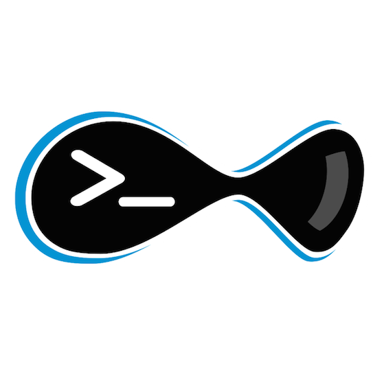
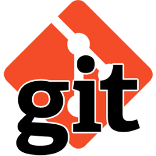

# Devilbox

| **Overview** | **Installing** | **Updating** | **Configuration** | **Usage** | **Technical** | **FAQ** |

---


### Dockerized LAMP/MEAN stack

<p class="center">The devilbox is a modern and highly customisable LAMP and MEAN stack replacement based purely on docker and docker-compose running on all major platforms. It supports an unlimited number of projects for which vhosts and DNS records are created automatically. Email catch-all and popular development tools will be at your service as well.</p>


### Supported Host OS

<p class="center">Don't worry about switching computers. The devilbox will run on all major operating systems.</p>

<div class="center">
  
  
  
</div>


### Install, Configure and Start

<p class="center">Your whole development stack is up and running in a few simple steps.</p>

```shell
# Get the soures
$ git clone https://github.com/cytopia/devilbox
$ cd devilbox

# Create and customize the config file
$ cp env-example .env
$ vim .env

# Start your daemons
$ docker-compose up
```


### Run exactly what you need

<p class="center">Choose your required daemons and select a version. Any combination is possible.<br/>This will allow you, to always exactly simulate your production environment locally during development.</p>

| Apache | Nginx   | PHP  | MySQL | MariaDB | PgSQL | Redis | Memcached | MongoDB |
|------- |---------|------|------ |---------|-------|-------|-----------|---------|
| 2.2    | stable  | 5.4  | 5.5   | 5.5     | 9.1   | 2.8   | 1.4.21    | 2.8     |
| 2.4    | mainline| 5.5  | 5.6   | 10.0    | 9.2   | 3.0   | 1.4.22    | 3.0     |
|        |         | 5.6  | 5.7   | 10.1    | 9.3   | 3.2   | 1.4.23    | 3.2     |
|        |         | 7.0  | 8.0   | 10.2    | 9.4   |       | ...       | 3.4     |
|        |         | 7.1  |       | 10.3    | 9.5   |       | 1.4.36    | 3.5     |
|        |         | HHVM |       |         | 9.6   |       | latest    |         |


### Run only what you need

<p class="center">You are not forced to load the whole stack everytime. Only bring up what you really need.<br/>It is also possible to add or remove daemons while the stack is already running.</p>

```shell
# Load traditional lamp stack only
$ docker-compose up httpd php mysql

# Add redis to the running stack
$ docker-compose up redis

# Stop MySQL from the current stack
$ docker-compose stop mysql
```


### Introduction Videos

<p class="center">Head over to youtube for a quick introduction and see for yourself how easily new projects can be created.</p>

<div class="center">
  <a target="_blank" href="https://www.youtube.com/watch?v=reyZMyt2Zzo" alt="Devilbox introduction video" title="Devilbox introduction video"></a>
  <a target="_blank" href="https://www.youtube.com/watch?v=e-U-C5WhxGY" alt="Devilbox Email catch-all introduction" title="Devilbox Email catch-all introduction"></a>
</div>


### Batteries included

<p class="center">No need to download external tools. Everything is bundled, up-to-date and available inside the containers.</p>

<div class="center">
  <a target="_blank" title="phpMyAdmin" href="https://www.phpmyadmin.net"></a>
  <a target="_blank" title="Adminer" href="https://www.adminer.org"></a>
  <a target="_blank" title="OpCache GUI" href="https://github.com/amnuts/opcache-gui"></a>
  <a target="_blank" title="Email catch-all" href="#"></a>
  <a target="_blank" title="DNS resolver" href="#"></a>
  <br/> 
  <a target="_blank" title="Composer" href="https://getcomposer.org"></a>
  <a target="_blank" title="Drush" href="https://www.drupal.org/project/drush"></a>
  <a target="_blank" title="Drupal Console" href="https://drupalconsole.com"></a>
  <a target="_blank" title="NodeJS" href="https://nodejs.org"></a>
  <a target="_blank" title="WP-CLI" href="https://wp-cli.org"></a>
  <a target="_blank" title="NPM" href="https://www.npmjs.com"></a>
  <a target="_blank" title="Git" href="https://git-scm.com"></a>
</div>


### Supported Frameworks and CMS

<p class="center">There is nothing special about the devilbox, so any framework or CMS that will work with normal LAMP/MEAN stacks will work here as well. However in order to make double sure, a few popular applications have been explicitly tested.</p>

<div class="center">
  <a target="_blank" title="CakePHP" href="https://cakephp.org" ></a>
  <a target="_blank" title="Drupal" href="https://www.drupal.org/" ></a>
  <a target="_blank" title="PhalconPHP" href="https://phalconphp.com" ></a>
  <a target="_blank" title="Wordpress" href="https://wordpress.org" ></a>
  <a target="_blank" title="Yii" href="http://www.yiiframework.com" ></a>
</div>


### Devilbox Intranet

<p class="center">Once the devilbox is up and running, you can visit the bundled intranet on <a target="_blank" href="http://localhost">http://localhost</a>.<br/>The intranet is not just a simple dash, it provides many useful tools:</p>

<div class="center">
  Container Health | DNS Status | Available vHosts | Emails | Databases | Effective Configuration<br/>
  
</div>


### Security

<p class="center">Be aware that the docker service is running with root privileges on your system (like any other webserver for example). The devilbox is using a mix of official docker images and custom images. All integrated containers are available on <a target="_blank" href="https://github.com/cytopia/devilbox#run-time-matrix">Github</a> and can be reviewed at any time.</p>


### Up-to-dateness

<p class="center">Docker containers are pushed to <a target="_blank" href="https://hub.docker.com/r/cytopia">Docker Hub</a> frequently.<br/>It should be enough for you to pull updated images on a regeular basis.</p>

```shell
$ docker-compose pull
```

<p class="center">However, if a new minor version (PHP for example) has just been released and you want to use it right away with the devilbox, you can simply *git clone* the docker repository and rebuild the container. Each container repository contains a shell script for easy building.</p>

```shell
# Download PHP 7.1 repository
$ git clone https://github.com/cytopia/docker-php-fpm-7.1

# Rebuild the container in order to get the latest minor/patch version
$ cd docker-php-fpm-7.1
$ ./build/docker-rebuild.sh
```


### Integration Tests

<div class="center">
  <a target="_blank" href="https://travis-ci.org/cytopia/devilbox"></a>
</div>

<p class="center">In order to make sure everything always runs stable and as expected, the devilbox makes heavy use of integration tests. You can head over to <a target="_blank" href="https://travis-ci.org/cytopia/devilbox">Travis-CI</a> and have a look at stable and nightly builds.</p>
